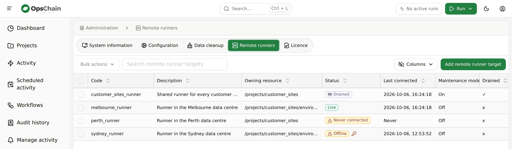
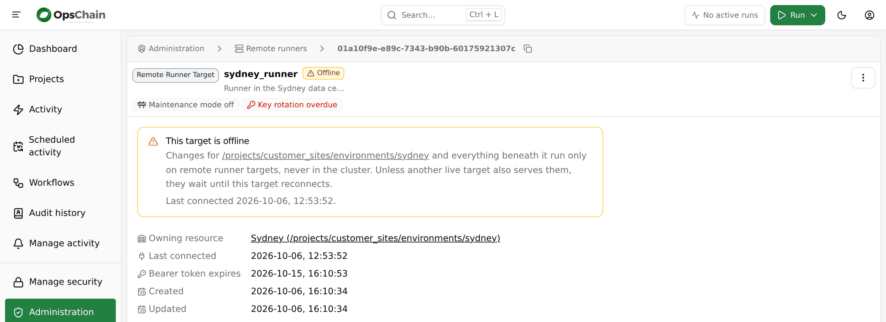
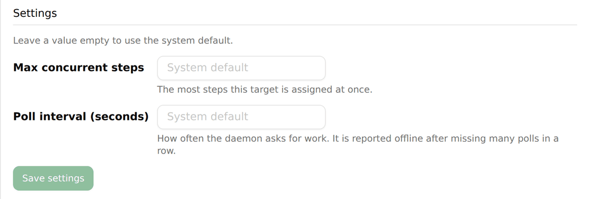
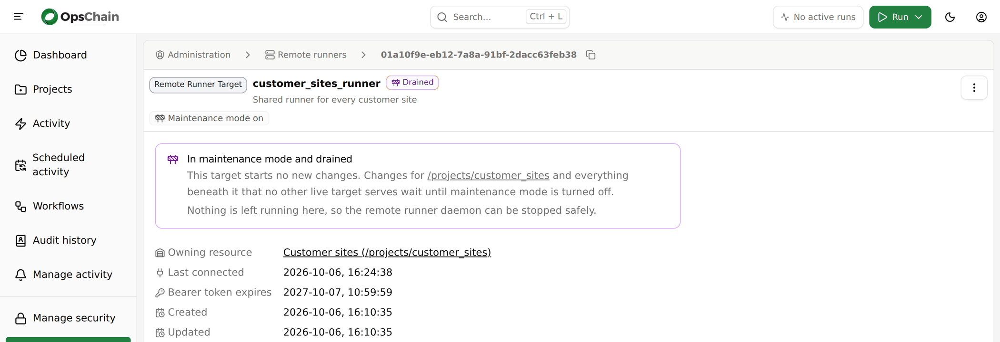

# Remote runners

:::warning[Feature preview]
Remote runners are complete and supported for evaluation. Settings, file names and the daemon's packaging may still change before general availability.
:::

Normally OpsChain runs a change in pods inside its own Kubernetes cluster, so those pods need a network path to whatever the change works on. A remote runner lets OpsChain run a change on a host inside a network it cannot reach, such as a customer site behind a firewall. A daemon on that host connects **outbound** to OpsChain, claims work, runs it in containers on the host, and sends the logs and results back over the same connection. Nothing in that network has to accept a connection from OpsChain.

Use a remote runner when the infrastructure a project, environment or asset manages is only reachable from inside another network, and opening an inbound path to it from OpsChain is not acceptable.

To install one, follow [set up a remote runner](setup.md). This page describes how remote runners behave once they are running.

## How it works

- A **remote runner target** in OpsChain represents one daemon and the host it runs on. Each target has its own token and its own RSA key pair, and is either owned by a project, environment or asset, or serves the whole instance.
- When a change runs on a node that a target serves, OpsChain still builds the change's runner image in its own cluster, as it always does. It then records the work for a target to claim rather than starting a pod.
- The daemon polls OpsChain for work, pulls the runner image through the OpsChain API host, and runs the work in a rootless container on its host. Each container gets its own network namespace with outbound access, so the action code can reach the hosts it manages.
- Inside the container, the action code talks to OpsChain through a Unix socket that the daemon provides, so properties, Git remote pushes, secret vault reads and the other `OpsChain` DSL calls work as they do in a pod. The daemon relays those calls over its outbound connection.
- Step output appears in the change log as usual, and the result is reported back when the work finishes.

All traffic between the daemon and OpsChain is HTTPS, started by the daemon, to the same host and port as the OpsChain API.

The daemon can be installed in [simple mode or advanced mode](setup.md#choose-a-packaging-mode). Both run the same daemon and behave as described on this page.

## Which changes run remotely

A target either serves the whole OpsChain instance or is owned by a project, environment or asset:

- A target with no owning resource serves every change in the instance. Only a superuser can create one.
- A target owned by a node serves changes on that node and on every node below it. For example, a target owned by a project serves changes on the project, its environments and their assets.

{/* TODO(scope paths): document a target's scope paths once the GUI create/edit forms support them. A target with scope paths serves changes on or beneath any of them instead of its owning node's subtree. */}

If **any** target serves a change's node, that change runs remotely, whether or not the target is connected. When no target that serves the node is live, the work waits until one is: OpsChain never falls back to running it in its own cluster. Creating a target with no owning resource therefore sends every change in the instance to remote runners.

Every kind of change can run remotely:

- With [`pod_per_change_step`](/key-concepts/settings.md#pod_per_change_step) set to `true`, each step runs in its own container and is claimed separately. Different steps of the same change may run on different targets that serve its node.
- With `pod_per_change_step` set to `false` (the default), and for MintModel changes, the whole change runs in one long-lived container on one target, the remote equivalent of the change worker pod. Its steps run inside that container, up to [`parallel_change_worker_steps`](/key-concepts/settings.md#parallel_change_worker_steps) at a time, and stay on that target for the life of the change.

Changes that run remotely never use [executor pool](/key-concepts/settings.md#executor-pool-settings) pods, whatever the `executor_pool` settings say.

When a target claims work, OpsChain records an `info:remote_runner_assignment:claimed` event against the change, naming the target.

## Managing targets

Remote runner targets are listed under **Administration > Remote runners** in the OpsChain GUI. Everything on this page can also be done through the API: see the [remote runner targets API](pathname:///api-docs/#tag/Remote-runner-targets).



The list shows each target's owning resource, its status, when its daemon last connected, and whether it is in maintenance mode or drained. Select targets and use **Bulk actions** to turn maintenance mode on or off, or to delete them.

### Who can manage targets

A target owned by a node is authorised against the path `<node path>/remote_runner_targets`, using the usual [authorisation rules](/getting-started/familiarisation/gui/manage_security.md#how-opschain-authorisation-works):

| Action                      | Permission needed on `<node path>/remote_runner_targets` |
|-----------------------------|------------------------------------------------------------|
| List or view the target     | Read                                                       |
| Create or update the target | Update                                                     |
| Delete the target           | Delete                                                     |

Only a superuser can see or manage a target that serves the whole instance.

### Target status

Each target shows one of these statuses, in the list and on its own page:

| Status              | Meaning                                                                                                                   |
|---------------------|---------------------------------------------------------------------------------------------------------------------------|
| **Live**            | The daemon is polling for work. See [liveness and lost targets](#liveness-and-lost-targets).                             |
| **Offline**         | The daemon has stopped polling. Shown as a warning.                                                                       |
| **Never connected** | No daemon has connected to the target since it was created. Shown as a warning.                                           |
| **Maintenance**     | The target is in [maintenance mode](#maintenance-mode-and-draining) and is still finishing work it has started.           |
| **Drained**         | The target is in maintenance mode and has nothing left in flight, so its daemon can be stopped safely.                    |

A key icon next to the status means the target's key rotation is overdue: its token is due to be replaced, but the daemon is not live to receive the new one. The target's page shows this as **Key rotation overdue**, alongside when the current token expires.

An offline target matters more than its warning colour suggests. Any change on a node it serves runs remotely whether or not it is connected, so unless another live target serves the same node, those changes wait until it reconnects. The target's page says which changes are affected and when the daemon last connected:



For a target with no owning resource, that is every change in the instance. Check the daemon on its host (see [troubleshooting](#troubleshooting)), or delete the target if it is no longer needed.

### The target's token

The daemon authenticates with a bearer token that OpsChain shows once, when the target is created. Reading the target later never shows it again. If the token is lost, delete the target and create a new one.

The token is only accepted on the endpoints the daemon calls, so it cannot be used for the rest of the API. OpsChain rotates it automatically: once the token is within 30 days of expiring, OpsChain offers the daemon a replacement, encrypted to the target's key, and retires the old token when the daemon first uses the new one. The daemon keeps the current token in its state directory, so the token in its configuration file may be older than the one in use. There is nothing to rotate by hand.

## Concurrency and polling

Three settings control how a target works. Each has an instance-wide default in the [remote runner settings](/key-concepts/settings.md#remote-runner-settings), and can be set for an individual target:

| Setting                  | Default | Meaning                                                                                                                                  |
|--------------------------|---------|------------------------------------------------------------------------------------------------------------------------------------------|
| `max_concurrent_steps`   | `5`     | How much work the target runs at once. Each step run in its own container counts as one, and so does a whole change run in one container. |
| `poll_interval`          | `3`     | How often, in seconds, the daemon polls OpsChain for new work.                                                                          |
| `zstd_compression_level` | `3`     | How hard OpsChain compresses its responses to the daemon, from `1` to `19`. Higher levels save bandwidth at the cost of CPU in OpsChain. |

A target's page lets you edit its description, `max_concurrent_steps` and `poll_interval`. Leave a value empty to use the instance-wide default:



`zstd_compression_level` is not editable in the GUI. To set it for one target, update the settings document that the target's `settings` relationship links to, through the [settings API](pathname:///api-docs/#tag/Settings).

The daemon picks up a change to any of these settings on its next poll, without a restart.

## Liveness and lost targets

A target is **live** while its daemon has polled OpsChain within the last 40 poll intervals: two minutes with the default `poll_interval`. Only a live target is given new work.

When a target stops being live:

- Work it had claimed but not started is released, and another live target that serves the node can claim it. The same happens if the daemon stops reporting a claimed piece of work for three polls in a row.
- A step it had already started fails with `Step lost: remote runner target "<code>" is no longer reachable`.
- A change it was running in one container fails with `Change lost: remote runner target "<code>" is no longer reachable`. A started change is never moved to another target.

Deleting a target while it is running a step fails that step with `Step lost: its remote runner target was removed while the step was running`.

Cancelling a change that is running remotely tells the daemon to stop its containers.

## Maintenance mode and draining

Maintenance mode lets a target finish what it has started without taking on anything new. Use the **⋮** menu on a target's page, or **Bulk actions** in the list, to turn it on or off.

While a target is in maintenance mode it does not start any new change: it does not claim a change's first step, or a change that runs in one container. It keeps claiming the remaining steps of changes it has already started, so those run to completion. A new change on a node that only this target serves waits until maintenance mode is turned off.

Once nothing the target claimed is still running, it shows **Drained** (the `drained` attribute is `true`), and its daemon can be stopped safely, for example to [upgrade it](setup.md#upgrade-the-runner):



This is separate from the instance-wide [maintenance mode](/operations/maintenance/maintenance-mode.md), which holds back new changes everywhere.

## Secrets

Secrets reach a remote runner only in encrypted form. OpsChain encrypts each value to the target's public key (RSA-OAEP, wrapping a one-off AES-256-GCM key for values too long for RSA alone), so only the daemon holding the private key can read it.

- **Runner secrets.** The step's [runner secrets](/key-concepts/step-runner.md#secure-secrets) are sent encrypted and set in the container's environment as they are in a pod. They are masked in the step's output.
- **Build secrets** are only used while OpsChain builds the runner image in its own cluster, so they are never sent to the target.
- **Secret vault.** Inside a remote container, `OpsChain.secret_vault` and properties that reference secret vault values go through the daemon to OpsChain, which reads the vault for the action and returns the value encrypted to the target. Access is limited to the vault configuration of the change being run, and the value is masked in the step's output.
- **MintModel changes.** For a change that runs in one container, OpsChain also sends the instance's MintPress licence and transportable key, encrypted to the target.

Only reading from the secret vault is supported remotely. [`OpsChain.secret_vault.get`](/key-concepts/actions.md#opschainsecret_vaultget) and `get_password` work, including generating a new secret when none exists. Any other secret vault method fails with `SecretVault#<method> is not available on a remote runner`.

A `default:` value cannot be stored in the vault from a remote runner. A call that supplies `default:` fails with `storing a default value in the secret vault is not supported on a remote runner` when the default would be stored: that is, unless automatic creation is off, either for the call (`auto_create: false`) or through the [`vault.password_auto_create`](/key-concepts/settings.md#vaultpassword_auto_create) setting, and the call does not pass `override: true`. When automatic creation is off, a missing secret returns the default without storing it, as it does in a pod:

```ruby
OpsChain.secret_vault.get('vault/path/to/secrets', 'secret_key', default: 'fallback', auto_create: false)
```

## Git remotes, images and logs

- **Runner images.** OpsChain builds each change's runner image in its own cluster as usual. The daemon pulls it through a registry proxy on the OpsChain API host, which only serves the images of work the target has claimed, and keeps a local cache so later pulls only fetch the layers that changed.
- **Git remotes.** The project Git remotes that the [`git_remote.mountable`](/key-concepts/settings.md#git_remotemountable) setting allows are copied to the target as Git bundles, so the [`git_clone` resource](/advanced/resource-types/index.md#opschain-git-clone) works remotely. The daemon keeps its own mirrors and fetches only what has changed since its last copy.
- **Logs.** Step output appears in the change log as it does for a pod. If the daemon cannot reach OpsChain for a while, it buffers the output on disk and sends it once it can. If the buffer for one piece of work passes `OPSCHAIN_LOG_DISK_CAP_BYTES`, the oldest output is dropped and the log says how many bytes were lost.
- **Dry runs.** When OpsChain runs a step as a dry run, for example to discover a change's step tree, the container's environment includes `OPSCHAIN_DRY_RUN=true`, as it would in a pod.

## Network access and proxies

By default each container gets its own network namespace with outbound access through `slirp4netns`, so action code can reach the hosts it manages from the remote host's network. Set `OPSCHAIN_NETWORK=none` in the daemon's configuration to give containers no network at all; they can then reach only OpsChain, through the daemon's socket.

If the remote host needs a proxy, set `HTTPS_PROXY`, `HTTP_PROXY` and `NO_PROXY` (or their lower-case forms) in the daemon's configuration. The daemon uses them for its own connection to OpsChain and passes them into every container, adding `localhost` and `127.0.0.1` to `NO_PROXY` so the action's calls to OpsChain through the socket bypass the proxy.

A container cannot reach the host's loopback interface, so a proxy listening on `localhost` or `127.0.0.1` on the host is not usable from inside one. Use a proxy on a non-loopback address. The daemon logs a warning when it starts if a configured proxy is on the loopback interface.

## Daemon compatibility

The daemon sends its protocol version with every request, and OpsChain accepts the protocol versions it supports. The current protocol version is `0.1.0`. Within a protocol version, OpsChain releases only add to the protocol, so a daemon keeps working after OpsChain is upgraded. You do not need to upgrade a target every time you upgrade OpsChain.

A release that changes the protocol version says so in its [changelog](/changelog.md), and from then on an older daemon is refused. A refused daemon logs `daemon version rejected; blocked until upgraded to <version>`, stops claiming work and is no longer live. [Upgrade the runner](setup.md#upgrade-the-runner) to bring it back.

## Limitations

- **Resource limits are not enforced.** OpsChain sends the [`pod_templates.<pod type>.resources`](/key-concepts/settings.md#pod_templatespod-typeresources) limits for `step_runner` (or `change_worker`, for a change run in one container) to the daemon, but in this preview the daemon does not apply them, in either packaging mode. A step's log says `resource limits are not enforced for this step because cgroup delegation is not in effect on this target`.
- **Only resource limits are taken from the pod settings.** Settings that only make sense for a Kubernetes pod, such as [`pod_templates.<pod type>.volumes`](/key-concepts/settings.md#pod_templatespod-typevolumes) and node selectors, have no effect on a remote container.
- **Secret vault writes** are not supported remotely. See [secrets](#secrets).
- **No executor pooling.** Remote work always gets a container of its own. See [which changes run remotely](#which-changes-run-remotely).
- **A started change stays on its target.** A change run in one container is not moved to another target if its target is lost; it fails. See [liveness and lost targets](#liveness-and-lost-targets).

## Troubleshooting

**Reading the daemon's log.** In simple mode, `sudo journalctl -u opschain-remote-runner`. In advanced mode, `journalctl --user -u opschain-remote-runner` as the runner account; see [advanced-mode troubleshooting](setup.md#advanced-mode-troubleshooting) if it reports `insufficient permissions`. A step's own output is always in the change log in OpsChain.

**The target never becomes live.** Check that the service is running (`systemctl status opschain-remote-runner`, or `systemctl --user status opschain-remote-runner` in advanced mode), that the host can reach `OPSCHAIN_SAAS_URL` (through the proxy, if there is one), and the daemon's log for errors. The daemon must trust the certificate OpsChain presents: simple mode uses the certificate authorities in its image, so the certificate must be issued by a publicly trusted authority; advanced mode uses the host's trust store, so add your own authority with `update-ca-trust`.

**The daemon logs `daemon version rejected; blocked until upgraded to <version>`.** OpsChain no longer accepts the daemon's protocol version. [Upgrade the runner](setup.md#upgrade-the-runner). See [daemon compatibility](#daemon-compatibility).

**A change waits, or its log says `Waiting for an available remote runner target.` or `Waiting for an available remote runner target to claim this step.`** A target serves the change's node, but none that does is live, or the only live ones are in maintenance mode and the change has not started yet. Check the status of the targets that serve the node. If the change should not run remotely at all, check which targets serve its node: a target with no owning resource serves every change.

**A step fails with `Step lost`, or a change with `Change lost`.** The target stopped polling while it was running the work. Check that the host is up, the service is running and the host can still reach OpsChain. See [liveness and lost targets](#liveness-and-lost-targets).

**A step fails with `slirp4netns could not give the container its network`.** Check that `/dev/net/tun` exists on the host. In simple mode, also check that the unit binds it into the container (`--bind=/dev/net/tun`).

**An action cannot reach a host or the internet.** Check that `OPSCHAIN_NETWORK` is not `none`, that the remote host itself can reach the destination, and that any proxy the action needs is set in the daemon's configuration on a non-loopback address.

**A secret vault call fails with `storing a default value in the secret vault is not supported on a remote runner`.** Add `auto_create: false` to the call. See [secrets](#secrets).

**Finding which target ran a change.** Look for the `info:remote_runner_assignment:claimed` events on the change. Each names the target that claimed a step, or the whole change.
