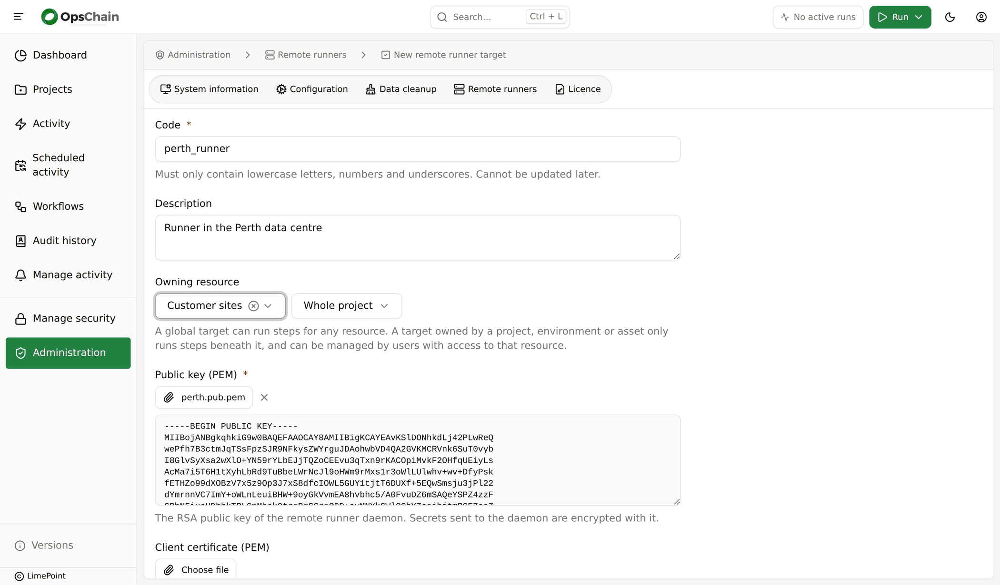
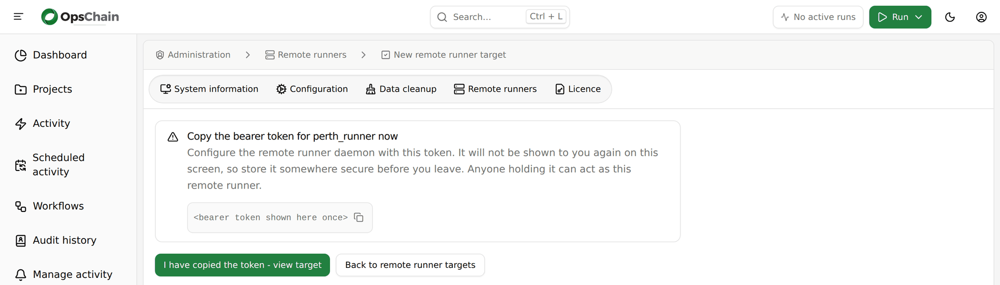

# Set up a remote runner

:::warning[Feature preview]
Remote runners are complete and supported for evaluation. Settings, file names and the daemon's packaging may still change before general availability.
:::

Set up a [remote runner](index.md) to let an existing OpsChain instance run changes on a host inside your network. The daemon on that host only ever connects outbound to OpsChain, so nothing in your network has to accept a connection from it.

Two people are usually involved, and this guide marks which steps belong to each:

- The **OpsChain administrator** creates the remote runner target in OpsChain. They need permission to manage targets: a superuser for a target that serves the whole instance, or Update on `<node path>/remote_runner_targets` for one owned by a project, environment or asset (see [who can manage targets](index.md#who-can-manage-targets)).
- The **host administrator** installs and runs the daemon on a host in your network. They never need access to OpsChain's own cluster.

## Choose a packaging mode

Both modes run the same daemon and behave the same once installed. They differ in what you install and what it needs:

|                              | Simple mode                                         | Advanced mode                                                        |
|------------------------------|-----------------------------------------------------|----------------------------------------------------------------------|
| What you install             | One disk image and one system service               | RHEL packages, then a small daemon archive in an ordinary account   |
| How it runs                  | A `systemd-nspawn` system service                   | A systemd user service in that account                               |
| Root needed                  | To install, run and upgrade it                      | Only to install the packages, create the account and enable lingering |
| Runtime dependencies         | Inside the image                                    | Your own RHEL 9 packages, installed with `dnf`                       |
| Visible to your CVE scanning | No, the image is opaque                             | Yes, and patched by your own `dnf update`                            |

Choose **simple mode** when you want the fewest moving parts and can run a root service: everything the daemon needs comes in one image, and the host needs only `systemd-nspawn`.

Choose **advanced mode** when your policy does not allow a root-run service, or your security team needs every component the runner relies on to be visible to its package manager and scanning. It takes more setup, but once installed nothing in the runner's lifecycle needs root.

## Prerequisites

For both modes:

- A host running RHEL 9 or a compatible distribution (AlmaLinux, Rocky Linux, Oracle Linux).
- Outbound HTTPS from the host to the OpsChain API's host and port, directly or through a proxy. The daemon pulls runner images through the same host, so nothing else in OpsChain needs to be reachable.
- `/dev/net/tun`, which RHEL 9 provides by default, so each container can be given its own network.
- Network access from the host to whatever the changes it runs will manage.
- Disk space for the runner images the daemon caches. By default the cache may grow to 20 GiB.

Simple mode also needs root on the host, the `systemd-container` package (for `systemd-nspawn`), `systemd-repart`, and the DockerHub credentials provided with your OpsChain licence. Advanced mode's requirements are listed in [install advanced mode](#install-advanced-mode).

## Create the target's key pair

_Host administrator._

OpsChain encrypts every secret it sends to a target with that target's public key, so only the daemon holding the private key can read it. Create the key pair on the host, so the private key never leaves it:

```bash
umask 077
openssl genpkey -algorithm RSA -pkeyopt rsa_keygen_bits:3072 -out target.pem
openssl pkey -in target.pem -pubout -out target.pub.pem
```

Send `target.pub.pem` to the OpsChain administrator. Keep `target.pem` on the host; you install it with the daemon.

## Create the target in OpsChain

_OpsChain administrator._

1. In the OpsChain GUI, open **Administration > Remote runners** and click **Add remote runner target**:

   

2. Fill in the form:

   - **Code** is the target's unique code. It cannot be changed later.
   - **Owning resource** is the project, environment or asset whose changes the target runs. Leave it as **Global (no owning resource)** only if **every** change in the instance should run remotely. See [which changes run remotely](index.md#which-changes-run-remotely).
   - **Public key (PEM)** is the host administrator's `target.pub.pem`. Choose the file or paste its contents.

3. Click **Add remote runner target** at the bottom of the form. OpsChain shows the daemon's bearer token:

   

   **The token is only shown on this screen.** Copy it before leaving the page. If it is lost, delete the target and create a new one.

4. Click **I have copied the token - view target**. The target's ID is the last part of the address of its page, `/admin/remote_runner_targets/<target id>`.

Send the host administrator the OpsChain URL, the target's ID and its token, over a channel you would trust with a password. The token lets its holder act as this remote runner.

The new target shows **Never connected** until its daemon starts. Targets can also be created through the [remote runner targets API](pathname:///api-docs/#tag/Remote-runner-targets): the token is returned only by the create request, in `data.meta.bearer_token`.

## Install simple mode

_Host administrator._ Run these steps as root, or with `sudo`.

Simple mode runs the daemon inside a disk image with `systemd-nspawn`, as a system service. The image contains the daemon, its Ruby runtime and every tool it uses (`crun`, `skopeo`, `slirp4netns`, `git`, `zstd`).

### Build the disk image

The simple-mode image is published as `limepoint/opschain-remote-runner-simple-mode-content`, tagged with the OpsChain version it was built with. Use the tag for your OpsChain instance's version.

Turn it into a disk image with `systemd-repart`. These commands use Podman to pull and mount the image; any tool that gives you the image's filesystem as a directory, with ownership and file capabilities intact, will do:

```bash
version=<OpsChain version>
image=docker.io/limepoint/opschain-remote-runner-simple-mode-content:${version}

podman login docker.io
podman pull "${image}"
content_dir="$(podman image mount "${image}")"

mkdir -p /opt/opschain-remote-runner-image/repart.d
cat > /opt/opschain-remote-runner-image/repart.d/10-root.conf <<CONF
[Partition]
Type=root
Format=ext4
CopyFiles=${content_dir}:/
CONF

systemd-repart --empty=create --size=2G \
  --definitions=/opt/opschain-remote-runner-image/repart.d \
  /opt/opschain-remote-runner-image/simple-mode.raw

podman image unmount "${image}"
```

### Configure the daemon

The container runs under a fixed, unprivileged range of host user IDs: user `0` inside it is host UID `524288`, and the daemon runs inside it as UID `10001`, which is host UID `534289`. The configuration and state directories are bind mounted into the container, so create them with matching owners, and install the private key:

```bash
install -d -m 0755 /etc/opschain-remote-runner
install -d -o 534289 -g 534289 -m 0700 \
  /var/lib/opschain-remote-runner/sockets /var/lib/opschain-remote-runner/state
install -o 534289 -g 534289 -m 0600 target.pem /etc/opschain-remote-runner/target.pem
```

Create `/etc/opschain-remote-runner/env`, owned by UID `524288` with mode `0600`, with the details the OpsChain administrator sent:

```bash
OPSCHAIN_SAAS_URL=https://opschain.example.com
OPSCHAIN_TARGET_ID=<target id>
OPSCHAIN_TARGET_TOKEN=<bearer token>
OPSCHAIN_TARGET_PRIVATE_KEY=/etc/opschain-remote-runner/target.pem
OPSCHAIN_SOCKET_DIR=/var/lib/opschain-remote-runner/sockets
OPSCHAIN_STATE_DIR=/var/lib/opschain-remote-runner/state
XDG_RUNTIME_DIR=/var/lib/opschain-remote-runner/state
```

```bash
chown 524288:524288 /etc/opschain-remote-runner/env
chmod 0600 /etc/opschain-remote-runner/env
```

`OPSCHAIN_SAAS_URL` is the address of your OpsChain instance, without the `/api` suffix. See [daemon configuration](#daemon-configuration) for the optional settings, including a proxy.

### Install and start the service

Download the service's unit file to `/etc/systemd/system/opschain-remote-runner.service`:

```bash
curl -fsSLo /etc/systemd/system/opschain-remote-runner.service \
  https://docs.opschain.io/files/downloads/opschain-remote-runner.service
```

If the host cannot reach the internet, <a href='/files/downloads/opschain-remote-runner.service' download='opschain-remote-runner.service'>download `opschain-remote-runner.service`</a> on a workstation and copy it to that path with `scp`.

It runs the daemon's image with `systemd-nspawn`:

```ini
[Service]
Delegate=yes
ExecStart=systemd-nspawn --quiet --keep-unit --kill-signal=SIGTERM --register=no --private-users=524288:65536 --private-users-ownership=map \
  --bind=/etc/opschain-remote-runner --bind=/var/lib/opschain-remote-runner --bind=/dev/net/tun \
  --image=/opt/opschain-remote-runner-image/simple-mode.raw --chdir=/opt/opschain-remote-runner/daemon -- /bin/bash /root_wrapper.sh
```

`--private-users-ownership=map` needs systemd 252 or later, which RHEL 9 has. On an older systemd, change it to `--private-users-ownership=chown`.

Enable and start the service:

```bash
systemctl daemon-reload
systemctl enable --now opschain-remote-runner
```

Then [check the target is live](#check-the-target-is-live-and-run-a-change).

## Install advanced mode

Advanced mode installs the daemon into an ordinary account and runs it as a systemd user service. Ruby and every tool the daemon uses come from your RHEL 9 repositories; the daemon's own code comes in a small archive downloaded from your OpsChain instance. The archive contains only the daemon, three pure-Ruby gems it uses (`base64`, `logger` and `webrick`, with their licences), a launcher, a preflight script, the systemd user unit and an example configuration file. It contains no Ruby runtime, no container tools and no compiled code.

### Prepare the host

_Host administrator, as root._ These are the only steps that need root.

1. The daemon needs Ruby 3.3, from the `ruby:3.3` module stream; the default `ruby` stream on RHEL 9 is older. Install it and the tools the daemon uses:

   ```bash
   sudo dnf module enable ruby:3.3
   sudo dnf install ruby rubygem-json crun skopeo slirp4netns git-core zstd
   ```

   The daemon runs `/usr/bin/ruby`, so a Ruby installed elsewhere, by a version manager for example, is not used. `shadow-utils` and `util-linux`, which every RHEL 9 installation has, provide `newuidmap`, `newgidmap`, `unshare` and `nsenter`.

2. Choose the ordinary account the runner runs as. It needs no group memberships and no `sudo` rights. These examples use `opschain-runner`.

3. The account needs a range of subordinate user and group IDs to map the containers' users into. On RHEL 9, `useradd` adds one automatically. Check with:

   ```bash
   grep "^opschain-runner:" /etc/subuid /etc/subgid
   ```

   If either file has no entry for the account, add one, choosing a range no other account uses:

   ```bash
   sudo usermod --add-subuids 200000-265535 --add-subgids 200000-265535 opschain-runner
   ```

4. Enable lingering, so the account's systemd user manager, and the runner with it, starts at boot and keeps running when nobody is logged in:

   ```bash
   sudo loginctl enable-linger opschain-runner
   ```

Unprivileged user namespaces must be enabled (`user.max_user_namespaces` greater than zero), which is the RHEL 9 default.

### Install the daemon

_Host administrator, as the runner account._ Log in to the account directly, for example over SSH, rather than switching to it with `su` or `sudo`, so `systemctl --user` can reach its user manager.

1. Create the runner's directories and move the private key into place:

   ```bash
   mkdir -p ~/opschain-remote-runner/releases ~/opschain-remote-runner/config ~/opschain-remote-runner/state
   install -m 0600 target.pem ~/opschain-remote-runner/config/target.pem
   ```

2. Download the daemon archive from your OpsChain instance. This needs an OpsChain API token for a user who can view the target; ask the OpsChain administrator for one if you have no OpsChain login.

   ```bash
   cd ~
   curl -fsS -OJ -D archive-headers.txt "https://opschain.example.com/api/remote_runner_targets/<target id>/daemon_archive" \
     -H "Authorization: Bearer <api token>"
   ```

   `-J` saves the file under the name OpsChain gives it, `opschain-remote-runner-<version>.tar.gz`. Check it against the SHA-256 in the response's `X-Checksum-Sha256` header:

   ```bash
   grep -i '^x-checksum-sha256:' archive-headers.txt
   sha256sum opschain-remote-runner-<version>.tar.gz
   ```

   A `404` titled `Remote runner archive not bundled` means your OpsChain build does not include the archive; contact LimePoint support.

3. Extract it and point `current` at it:

   ```bash
   tar -xzf opschain-remote-runner-<version>.tar.gz -C ~/opschain-remote-runner/releases
   ln -sfn releases/opschain-remote-runner-<version> ~/opschain-remote-runner/current
   rm archive-headers.txt opschain-remote-runner-<version>.tar.gz
   ```

   Each release lives in its own directory under `releases`, which makes an [upgrade](#upgrade-the-runner) a symlink swap.

4. Check the prerequisites:

   ```bash
   ~/opschain-remote-runner/current/bin/opschain-remote-runner-preflight
   ```

   It reports the installed packages, whether `/usr/bin/ruby` is Ruby 3.3, the account's subordinate ID ranges, lingering, user namespaces and `/dev/net/tun`, and exits non-zero when anything required is missing.

5. Create `~/opschain-remote-runner/config/env`, with mode `0600`, with the details the OpsChain administrator sent:

   ```bash
   OPSCHAIN_SAAS_URL=https://opschain.example.com
   OPSCHAIN_TARGET_ID=<target id>
   OPSCHAIN_TARGET_TOKEN=<bearer token>
   ```

   The release's `share/env.example` is a starting point. The unit sets the rest: the state directory, the private key's path and the directory for each container's socket. See [daemon configuration](#daemon-configuration) for the optional settings, including a proxy.

6. Install and start the user service:

   ```bash
   mkdir -p ~/.config/systemd/user
   cp ~/opschain-remote-runner/current/share/systemd/opschain-remote-runner.service ~/.config/systemd/user/
   systemctl --user daemon-reload
   systemctl --user enable --now opschain-remote-runner
   ```

## Daemon configuration

Both modes read the same optional settings from the daemon's `env` file:

| Variable                                | Purpose                                                                                                                                                              |
|-----------------------------------------|----------------------------------------------------------------------------------------------------------------------------------------------------------------------|
| `HTTPS_PROXY`, `HTTP_PROXY`, `NO_PROXY` | The proxy the daemon uses to reach OpsChain, also passed into every container. Use a proxy on a non-loopback address. See [network access and proxies](index.md#network-access-and-proxies). |
| `OPSCHAIN_NETWORK`                      | `slirp4netns` (the default) gives each container outbound network access. `none` gives it none, leaving only its connection to OpsChain through the daemon.          |
| `OPSCHAIN_IMAGE_CACHE_BUDGET_BYTES`     | How large the runner image cache may grow before the least recently used images are removed. Defaults to 20 GiB.                                                    |
| `OPSCHAIN_LOG_DISK_CAP_BYTES`           | How much output the daemon holds for each piece of work while it cannot reach OpsChain, before dropping the oldest. Defaults to 100 MiB.                             |

How much work a target runs at once, and how often it polls, are set on the target in OpsChain, not in this file. See [concurrency and polling](index.md#concurrency-and-polling).

Restart the service after changing the file.

## Check the target is live and run a change

1. In **Administration > Remote runners**, the target shows **Live** within a few seconds of the service starting. If it stays **Never connected**, see [troubleshooting](index.md#troubleshooting).
2. Run a change on a node the target serves. The change runs as usual, and the target's claim is recorded as an `info:remote_runner_assignment:claimed` event on the change, naming the target.

From then on, every change on the nodes the target serves runs on this host.

## Upgrade the runner

A daemon keeps working when OpsChain is upgraded, until a release changes the daemon protocol version. Its [changelog](/changelog.md) says when it does; see [daemon compatibility](index.md#daemon-compatibility). Upgrade the runner then, or whenever you want a newer daemon.

Stopping the daemon while it is preparing work loses that work, so drain the target first:

1. _OpsChain administrator._ Turn on [maintenance mode](index.md#maintenance-mode-and-draining) for the target, and wait until it shows **Drained**.
2. _Host administrator._ Replace the daemon:
   - **Simple mode:** stop the service (`systemctl stop opschain-remote-runner`), [build the disk image](#build-the-disk-image) again from the image tag for your OpsChain version, replacing `simple-mode.raw`, and start the service. Keep `/var/lib/opschain-remote-runner`, which holds the daemon's current token.
   - **Advanced mode:** [download the archive](#install-the-daemon) again, then switch to it:

     ```bash
     tar -xzf opschain-remote-runner-<new version>.tar.gz -C ~/opschain-remote-runner/releases
     ln -sfn releases/opschain-remote-runner-<new version> ~/opschain-remote-runner/current
     cp ~/opschain-remote-runner/current/share/systemd/opschain-remote-runner.service ~/.config/systemd/user/
     systemctl --user daemon-reload
     systemctl --user restart opschain-remote-runner
     ```

     Keep the old release in `releases` until the new one is working: switching `current` back and restarting is the rollback.
3. _OpsChain administrator._ Turn maintenance mode off.

## Remove the runner

1. _OpsChain administrator._ Turn on maintenance mode for the target and wait until it shows **Drained**.
2. _Host administrator._ Stop and remove the daemon:
   - **Simple mode:**

     ```bash
     systemctl disable --now opschain-remote-runner
     rm /etc/systemd/system/opschain-remote-runner.service
     systemctl daemon-reload
     rm -rf /opt/opschain-remote-runner-image /etc/opschain-remote-runner /var/lib/opschain-remote-runner
     ```

   - **Advanced mode**, as the runner account:

     ```bash
     systemctl --user disable --now opschain-remote-runner
     rm ~/.config/systemd/user/opschain-remote-runner.service
     systemctl --user daemon-reload
     rm -rf ~/opschain-remote-runner
     ```

     Files inside a container belong to the account's subordinate IDs. The daemon removes them when work finishes, but if work was interrupted, `rm` may report `Permission denied` under `state/bundles`. Start the runner again to let it clean up, or have an administrator remove the directory. An administrator can then disable lingering with `sudo loginctl disable-linger opschain-runner`.
3. _OpsChain administrator._ Delete the target. Its token stops working once the target is deleted.

## Advanced-mode troubleshooting

See also the [troubleshooting](index.md#troubleshooting) that applies to both modes.

**Start with the preflight script.** `~/opschain-remote-runner/current/bin/opschain-remote-runner-preflight` checks every host prerequisite.

**`journalctl --user` prints `No journal files were opened due to insufficient permissions`.** On a host whose journal is not persistent (no `/var/log/journal` directory), an ordinary account cannot read its own journal. Ask an administrator to make it persistent (`sudo mkdir -p /var/log/journal && sudo systemctl restart systemd-journald`), or to read it with `sudo journalctl _UID=$(id -u opschain-runner)`.

**`newuidmap failed` or `uid range not allowed` in a step's log.** The account has no subordinate ID range, or the range does not match `/etc/subuid` and `/etc/subgid`. See [prepare the host](#prepare-the-host).

**The runner stops when you log out.** Lingering is not enabled for the account. `loginctl show-user opschain-runner --property=Linger` must report `Linger=yes`.

**Looking at containers.** The daemon runs `crun` as the runner account, so `crun list`, run as that account, lists its containers.
