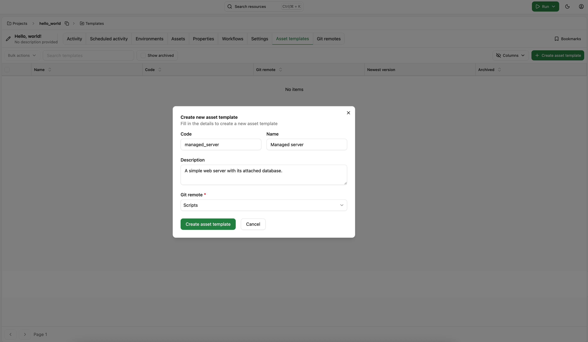
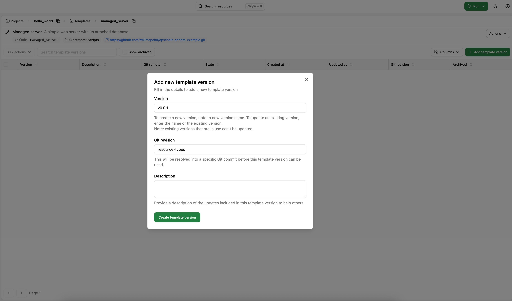
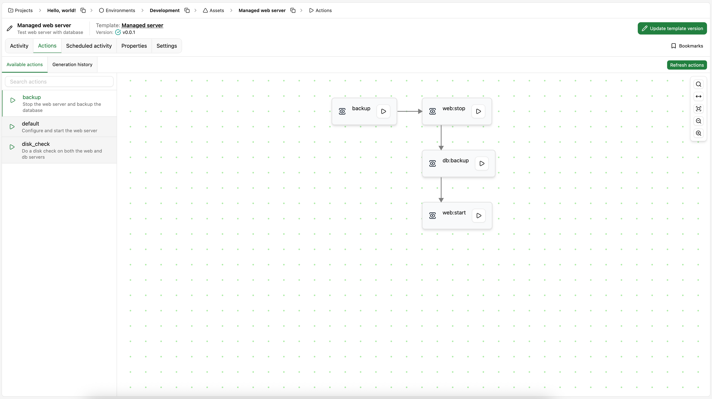
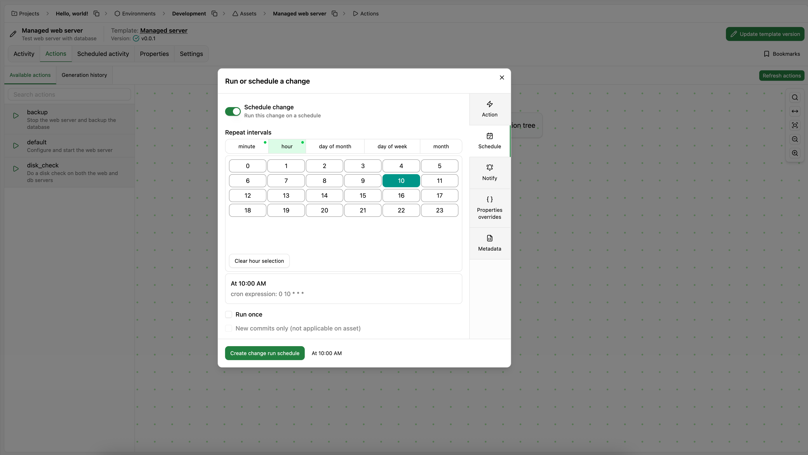

# Implementing resource types

In the [previous tutorial](./templated-actions.md), we learned how to create a reusable **asset template** to run a single task across many assets in different environments. That is great for simpler projects, but sometimes we need to manage higher-level deployments, usually involving different services with specific relationships between them.

For example, a common scenario is managing a web server that relies on a database server. Both could use a `disk_check` action, but the web server would require restarts and configuration much more frequently than the database server, which, in turn, needs to be backed up every once in a while.

You could create separate asset templates for each, but this would lead to duplicated code (like the `disk_check` script) and require an effort to keep both templates in sync, since each has to specify a Git revision individually. To resolve this complexity, OpsChain's **resource types** allow us to have a unified asset template that allows us to manage multiple resources from within a single template.

This tutorial will teach you how to build a single, multi-purpose asset template that contains multiple resource types, allowing you to manage complex assets while maintaining a single, clean codebase.

After following this guide you should know how to:

- Create a multi-purpose asset template in OpsChain with multiple resource types.
- Use OpsChain assets to provide configuration to your resource types.
- Orchestrate actions involving different resource types.

## Prerequisites

This tutorial builds slightly on the code used in the [previous tutorial](./templated-actions.md). We recommend following that tutorial first to get familiar with the basics of OpsChain and learn how to create an asset template and a template version.

## Building resources

In our Git repository, we'll create a dedicated folder for the `managed_server` resource type, this folder will be the definition of our asset template later.
We'll define some shell scripts to simulate the actions we'll be performing on the resources. These could instead be any other type of code, like Python or Ansible playbooks.

```text
.
└── managed_server/
    ├── actions.rb
    ├── resources.rb
    ├── backup_db.sh
    ├── configure_web.sh
    └── disk_check.sh
```

:::tip File permissions
Make sure the scripts are executable by running `chmod +x managed_server/*.sh`.
:::

### The scripts

Here are the contents for the three simple scripts:

#### `backup_db.sh`

```bash
#!/bin/bash
set -eo pipefail -o nounset

echo "--- Starting Database Backup ---"
echo "Backing up database on server: ${HOSTNAME}"
echo "Connecting to database..."
sleep 1
echo "Dumping database to backup file..."
sleep 1
echo "--- Backup Complete for ${HOSTNAME} ---"
```

#### `configure_web.sh`

```bash
#!/bin/bash
set -eo pipefail -o nounset

echo "--- Starting Web Server Configuration ---"
echo "Configuring server: ${HOSTNAME}"
echo "Applying base configuration..."
sleep 1
echo "Applying web-specific configuration..."
sleep 1
echo "--- Configuration Complete for ${HOSTNAME} ---"
```

#### `disk_check.sh`

```bash
#!/bin/bash
set -eo pipefail -o nounset

echo "--- Checking disk space ---"

DISK_THRESHOLD=$1
# In a real script, you would check the actual disk space.
# For this tutorial, we'll simulate a value.
CURRENT_DISK_USAGE=75

echo "Threshold is ${DISK_THRESHOLD}%, current usage is ${CURRENT_DISK_USAGE}%."

if [ "$CURRENT_DISK_USAGE" -gt "$DISK_THRESHOLD" ]; then
  echo "[ALERT] Disk space is low: ${CURRENT_DISK_USAGE}% used."
  exit 1
else
  echo "[OK] Disk space is sufficient: ${CURRENT_DISK_USAGE}% used."
fi

echo "--- Disk space check complete ---"
```

While they are inherently simple, these scripts could execute code as complex as you need them to be, like running Python scripts, interacting with deployments via Ansible playbooks, running terraform, etc. Just ensure you make the necessary dependencies available in your runner image by providing a custom [OpsChain's Dockerfile](/key-concepts/step-runner.md#creating-a-custom-step-runner-dockerfile) in your Git repository.

### The resource definitions

In the `resources.rb` file, we'll define our two different resource types: `web_server` and `db_server`. Each type can have their own set of properties and actions.

```ruby
# managed_server/resources.rb

# Define what a web_server resource is and what actions it can perform.
resource_type :web_server do
  property :hostname
  property :disk_threshold

  # We configure the web server before starting it to ensure it's ready to serve requests.
  action start: ['configure'], description: "Start the web server after it's been configured" do
    log.info "Starting up web server in #{hostname}..."
  end

  action :stop, description: 'Stopping the web server' do
    log.warn "Stopping the web server in #{hostname}"
  end

  # We do a disk check before configuring the web server to ensure the server will have enough disk space to run.
  action configure: ['disk_check'], description: 'Configure the web server' do
    log.info "Running configure action for #{hostname}"
    exec_command('./managed_server/configure_web.sh', env: { 'HOSTNAME' => hostname })
    log.info "Web server successfully configured in #{hostname}"
  end

  action :disk_check, description: 'Check web server disk space' do
    log.info "Running disk_check action for #{hostname} with threshold #{disk_threshold}"
    exec_command('./managed_server/disk_check.sh', disk_threshold.to_s)
  end
end

# Define what a db_server resource is and what actions it can perform.
resource_type :db_server do
  property :hostname
  property :disk_threshold

  # We do a disk check before backing up to ensure the server will have enough disk space.
  action backup: ['disk_check'], description: 'Backup the database server' do
    last_backup = OpsChain.properties_for(:asset).last_backup_at
    log.info "Last backup was at: #{last_backup || 'never'}"
    log.info "Running backup action for #{hostname}"

    # By default, the command will raise an error if it fails.
    exec_command('./managed_server/backup_db.sh', env: { 'HOSTNAME' => hostname })

    # We can leverage OpsChain properties and write-back to them to keep track of important information for our resources.
    # These properties are versioned and are accessible via the OpsChain UIs.
    OpsChain.properties_for(:asset).last_backup_at = Time.now.strftime('%Y-%m-%d %H:%M:%S')
    log.info "Database backup completed successfully"
  end

  action :disk_check, description: 'Check database server disk space' do
    log.info "Running disk_check action for #{hostname} with threshold #{disk_threshold}"
    exec_command('./managed_server/disk_check.sh', disk_threshold.to_s)
  end
end
```

With the resource types defined, we can now create the actual resources further down in the same file. We'll use OpsChain properties to dynamically configure each resource. This allows us to use the same template for different assets in different environments, with varying configurations.

```ruby
web_server :web do
  hostname OpsChain.properties.hostname
  disk_threshold OpsChain.properties.dig('disk_check', 'disk_threshold')
end

db_server :db do
  hostname OpsChain.properties.hostname
  disk_threshold OpsChain.properties.dig('disk_check', 'disk_threshold')
end
```

:::note Actions visibility
The actions we've defined in this file will not be visible in the OpsChain UI. You can imagine them as lower-level actions that perform actions in the resources individually, but we want to orchestrate them in our `actions.rb` file, providing organized, higher-level actions for any assets created from this template.
:::

### The `actions.rb` file

With our resources defined, we can now create an `actions.rb` file to specify high-level and user-facing actions we'll want to run for assets created from this template. We can add pre-requisites and child steps to the actions to control the order in which they run, ensuring we always follow the correct sequence of steps for every action.

```ruby
# managed_server/actions.rb
require_relative './resources.rb'

action :default, steps: ['web:start'], description: 'Configure and start the web server'
action :disk_check, steps: ['web:disk_check', 'db:disk_check'], description: 'Do a disk check on both the web and db servers'
action :backup, steps: ['web:stop', 'db:backup', 'web:start'], description: 'Stop the web server and backup the database. Restarts the web server when the backup is finished'
```

Now that we have defined the resources and actions, we can commit and push these new files to our Git repository and create a Git remote based on that repository. If you're unsure how to do this, you can refer to the [structure tutorial](./structure.md) for more details.

## Linking the asset template

With a Git remote created to map to our code, we can create an asset template named `managed_server` - matching the folder we've defined in the source code.

:::tip
Refer back to the [Hello World tutorial](/getting-started/tutorials/hello-world.md#adding-a-git-repository-to-your-project) on how to add a Git remote to a project if you need instructions on how to link a Git repository to OpsChain.
:::

### Create the asset template

In our project's asset templates page, we can create a new asset template by clicking on the "Create asset template" button:



Inside the page for the asset template we've just created, we define the template version our assets will use. We'll give it a name and specify the Git revision this version should be locked to. In our case, we pushed our code to the `resource-types` branch and we'll use that as our Git revision.



OpsChain will proccess the code and identify the actions available for the given template version, making them available for all the assets using it.

:::note Action list
OpsChain will only show actions that have been given a description in the `actions.rb` file.
:::

## Create and configure the assets

Now that we have successfully linked our code with OpsChain, we can create two different assets that use the *same* template but have different configurations. We'll create an asset in the `Development` environment and one in the `Staging` environment.

:::tip Creating environments and assets
Refer to the [structure tutorial](./structure.md) for more details on how to create environments and assets.
:::

The structure we'll create is the following:

```text
Projects/
├── hello_world/
│   ├── Environments/
│       ├── dev/
│       │   └── Assets/
│       │       └── managed_server
│       └── staging/
│           └── Assets/
│               └── managed_server
```

With that structure defined, we now have to provide the `hostname` and `disk_threshold` properties needed for each environment and asset. OpsChain allows us to do that at any level, either at the project, environment, asset or Git repository level, so it's up to us to decide where storing them makes sense. You can refer to the [properties](/key-concepts/properties.md) documentation for more details on how to store properties and how they are merged. In this tutorial, we'll store all of them at the asset level.

For the `staging` environment, we'll have the following properties:

```json
  {
    "hostname": "stg-web-01.example.com",
    "disk_check": {
      "disk_threshold": 80
    }
  }
```

For the `dev` environment, we'll have the following properties:

```json
  {
    "hostname": "web-01.localhost",
    "disk_check": {
      "disk_threshold": 60
    }
  }
```

## Running the defined actions

As soon as we've created the assets, OpsChain will automatically lookup the actions defined in our template version and make them available for use in the UI. They can be seen in the `Actions` tab inside the asset's page.



These actions can be run from the actions page by clicking on the `Run action` button next to the action name.

:::note Action processing
It might take a few minutes for OpsChain to build the image and process your actions. You can check the status of the action processing in the `Actions` tab and you can see previous action generations in the `Generation history` tab.
:::

By running the `backup` action on the asset inside the `Development` environment, we can see that it has followed its required steps and has successfully "backed up" the database.


If we now look at the properties for this asset, we can see that the `last_backup_at` property has been updated to when the backup action was run. On the top right corner of the properties tab, we can see at which version the properties are currently. In the `Compare versions` tab, we can compare the properties between different versions.


To make our life simpler, let's schedule the `backup` action to run on a regular basis using a [scheduled activity](/key-concepts/scheduled-changes.md). Using OpsChain's UI, we can quickly configure the action to run every day at 10am, for example.



We've successfully used a single template to perform specialized tasks on different types of assets, with full control over the steps each action takes using the OpsChain properties as the arguments for such actions. With our assets setup, we can now integrate them in a [workflow](/key-concepts/workflows.md) to perform multi-environment deployments or updates, with stages, human approval steps and much more.

## What to do next

- Learn how to [integrate secrets in OpsChain](/getting-started/tutorials/secrets.md) to secure your change lifecycle.
- See more advanced features of resource types in our [actions reference guide](/key-concepts/actions.md).
