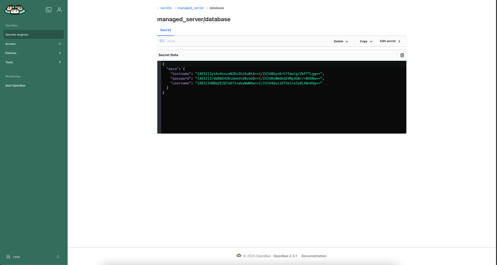
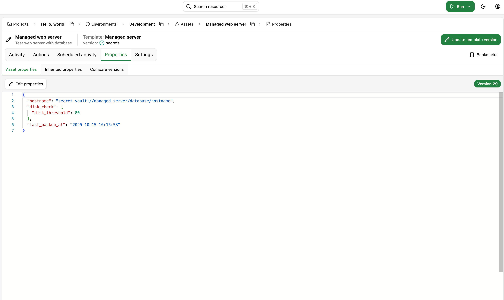
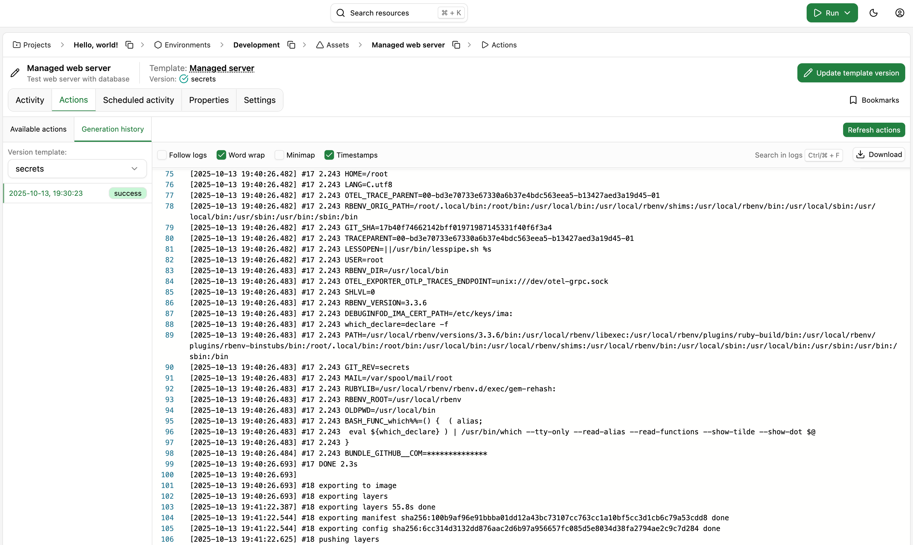
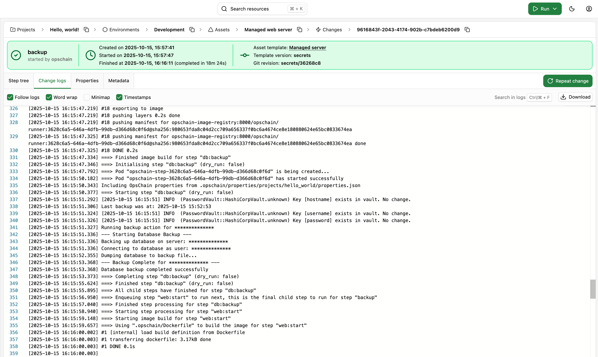

# Integrating secrets in OpsChain

So far in the previous tutorials we've been using raw properties to configure our actions and manipulate how they work. However, sometimes the information we use must be kept confidential, like API keys, passwords, or other sensitive information. Using secret vaults, OpsChain provides secure ways to provide information to our actions and build processes.

This guide will teach you how to use secret vaults in your change lifecycle.

After following this guide you should know how to:

- Use secrets from a secret vault in your actions.
- Use secret vaults when building your step runner images.

## Prerequisites

This tutorial builds on the [previous tutorial](./resource-types.md), we recommend following it first to get familiar with the basics of OpsChain and learn how to manage its resources. To follow this tutorial, you will need:

- A working OpsChain instance and access to the server where it is hosted
- A valid secret vault instance (installed by default with OpsChain)

### Accessing the secret vault UI (optional)

If you have installed OpsChain with the default secret vault, you can access its UI by navigating to the address you defined in your `values.yaml` file. Read more about the secret vault in the [secret vault settings](/setup/understanding-opschain-variables.md#secret-vault-settings) section to find the credentials you need to access the secret vault.

Once logged in the secret vault UI, you can view, create and update the secrets stored in the secret vault KV engine. Make a note of the paths for the secrets you want to access in your actions and properties.

:::info Custom vault
If you have your own secret vault, the KV engine may be mounted to a different path, this will be reflected in the path you use to access the secrets in your actions and properties. Check the secret vault settings in your `values.yaml` file to find the path to the KV engine.
:::

## Defining the secret vault secrets

To have a secret that OpsChain will read from, we'll create a secret named `managed_server/database` with the credentials for accessing the database. We'll use a key for the `username`, a key for the `password` and one for the `hostname` in our secret vault.



We'll also create another secret named `managed_server/web_server` with the credentials to access a private Gem repository. This secret will only contain a key for the `github_token`.

:::note Secret data
Notice that the keys of our secret are all under the `data` key. This pattern must be followed when using the default secret vault KV engine.

You can also see that the secrets are encrypted at rest. This is due to the double encryption used by OpsChain, configured by the [double encryption setting](/setup/understanding-opschain-variables.md#opschain_vault_use_mint_encryption).
:::

## Securing actions

Let's update the contents of our `backup_db.sh` script defined in the [previous tutorial](./resource-types.md#the-scripts) to accept database credentials as environment variables.

```bash
#!/bin/bash
# managed_server/backup_db.sh

set -eo pipefail -o nounset

echo "--- Starting Database Backup ---"
echo "Backing up database on server: ${HOSTNAME}"

# Validate that the required credentials are provided
if [ -z "${DB_USERNAME:-}" ] || [ -z "${DB_PASSWORD:-}" ]; then
  echo "ERROR: Database credentials not provided"
  exit 1
fi

echo "Connecting to the database as user: ${DB_USERNAME}"
sleep 1

echo "Dumping database to a backup file..."
sleep 1

echo "--- Backup Complete for ${HOSTNAME} ---"
```

Then, we can modify the `db_server` resource type we defined in the [previous tutorial](./resource-types.md#the-resource-definitions) to use the secure secrets from the secret vault and pass the necessary credentials as environment variables to the script.

```ruby
# managed_server/resources.rb
# remaining of the file stays the same...

# Define what a db_server resource is and what actions it can perform.
resource_type :db_server do
  property :hostname
  property :disk_threshold

  # We do a disk check before backing up to ensure the server will have enough disk space.
  action backup: ['disk_check'], description: 'Backup the database server' do
    last_backup = OpsChain.properties_for(:asset).last_backup_at
    log.info "Last backup was at: #{last_backup || 'never'}"

    # Retrieve database credentials from the secret vault
    # When using double encryption, the values we get from the vault are still encrypted.
    # By passing the `decrypt_vault_value: true` keyword argument, we will have access to the decrypted values.
    db_username = OpsChain.secret_vault.get('managed_server/database', 'username', decrypt_vault_value: true)
    db_password = OpsChain.secret_vault.get('managed_server/database', 'password', decrypt_vault_value: true)

    log.info "Running backup action for #{hostname}"
    exec_command('./managed_server/backup_db.sh', env: {
      'HOSTNAME' => hostname,
      'DB_USERNAME' => db_username,
      'DB_PASSWORD' => db_password
    })

    # We can leverage OpsChain properties and write-back to them to keep track of important information for our resources.
    # These properties are versioned and are accessible via the OpsChain UIs.
    OpsChain.properties_for(:asset).last_backup_at = Time.now.strftime('%Y-%m-%d %H:%M:%S')
    log.info "Database backup completed successfully"
  end
end

# remaining of the file stays the same...
```

Once both files are updated, we'll push the changes as a new branch in our Git repository. For this tutorial, we'll create a new branch called `secrets`, which will be attached to a new template version in OpsChain.

By default, when using the OpsChain DSL, OpsChain will create a secret at the specified path and key if it doesn't exist. If you'd like to prevent this, you can set the `auto_create` keyword argument to `false`. A number of other keyword arguments are available to customize the secret creation, refer to the [actions reference guide](/key-concepts/actions.md#opschainsecret_vaultget) for more information.

## Securing properties

The previous step covered how to access secrets from within actions. However, we can also manage the secrets we pass to our actions via OpsChain properties. For example, let's update the properties of our assets to fetch the `hostname` property from our secret vault instead of using a hardcoded value.



Note that the format for accessing the secret vault from within the properties must follow the pattern with `secret-vault://` as the prefix, followed by the secret path and then the secret key. You do not need to specify the KV mount path if it's been configured in the [vault settings](/setup/understanding-opschain-variables.md#opschain_vault_mount_path).

Since we have one asset in the `Development` environment and one in the `Staging` environment, we can update the properties of both assets to access the `hostname` property from the secret vault or point each to a different secret.

:::tip Secrets from properties
All the secrets accessed from OpsChain' properties will be decrypted and ready for use when accessed within your resources and actions.
:::

:::danger
If the secret doesn't exist at the path you provided in the properties, OpsChain will raise an error when trying to build the step runner image with these properties or when running the change.
:::

## Securing the image build process

Another critical aspect of securing your change lifecycle is being able to use credentials in the image build process in a safe manner. The image build process is the stage where OpsChain builds the image for the step runner, which will be used to run all actions within your change. Using OpsChain properties, we can define environment variables by adding them to the `opschain.env` section of our properties.

Let's update the properties of our `Development` environment to define the `github_token` from the `managed_server/web_server` secret in the image build process. For illustration purposes, we'll be mapping the secret to the `BUNDLE_GITHUB__COM` environment variable, which is used by the [Bundler Gem source credentials](https://bundler.io/man/bundle-config.1.html#CREDENTIALS-FOR-GEM-SOURCES).


:::warning Environment variables visibility
Beware that the environment variables defined in the `opschain.env` section of the properties are also available to the actions running inside the image.
:::

For demonstration purposes only, we've added the following line to the `.opschain/Dockerfile` in our Git repository, which will print all the environment variables that are available to commands running via `opschain-exec`:

```docker
RUN --mount=type=secret,required=true,id=env_context_zip,uid=10001,gid=10001,target=/opt/opschain/.opschain/step_context.json.zip opschain-exec env
```

And we can see that when running the image build process, the value of the `BUNDLE_GITHUB__COM` environment variable is printed in the logs of the image build process. Since the value comes from the secret vault, it is obfuscated in the change logs.



:::info Environment variables scope
Beware that OpsChain will only setup the environment variables for commands that are run via `opschain-exec`.
:::

## Running the change

Now that we have secured our actions, properties and image build process, we can run the change and verify that it works as expected. Our script is accessing the `hostname` with the credentials defined in the secret vault. Since all of our values come from the secret vault, they are all obfuscated in the change logs.



We've successfully secured the entire change lifecycle, covering all the aspects from actions to properties and the image build process.

## What to do next

- See more advanced features of resource types in our [actions reference guide](/key-concepts/actions.md).
