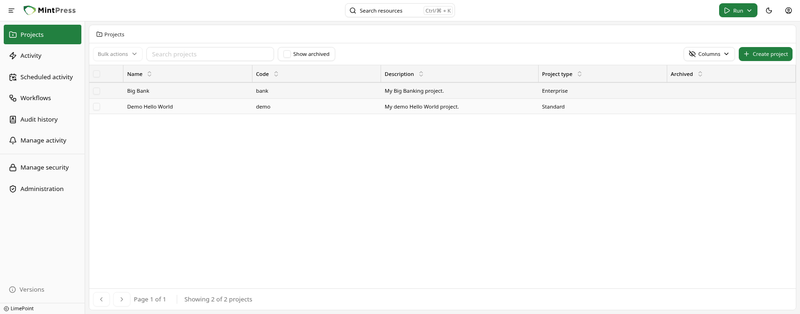
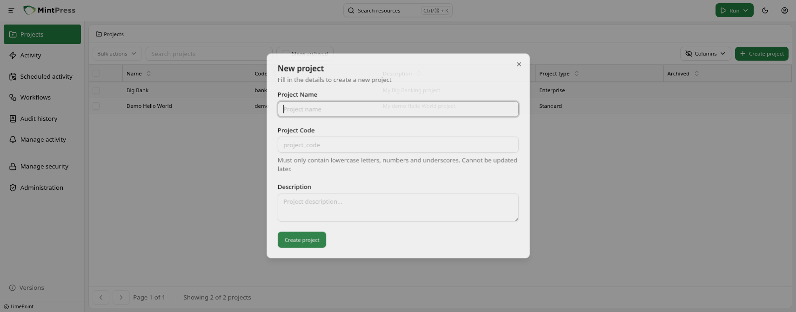
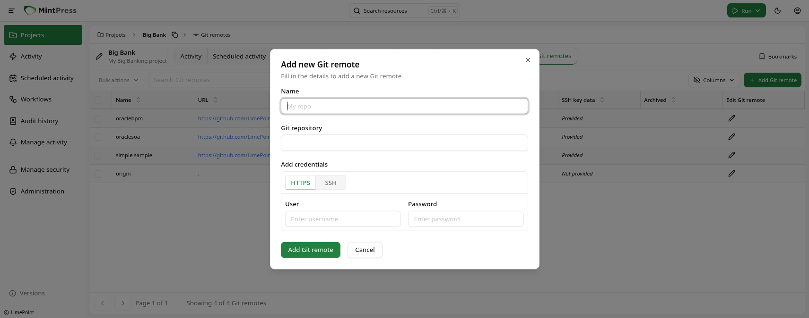
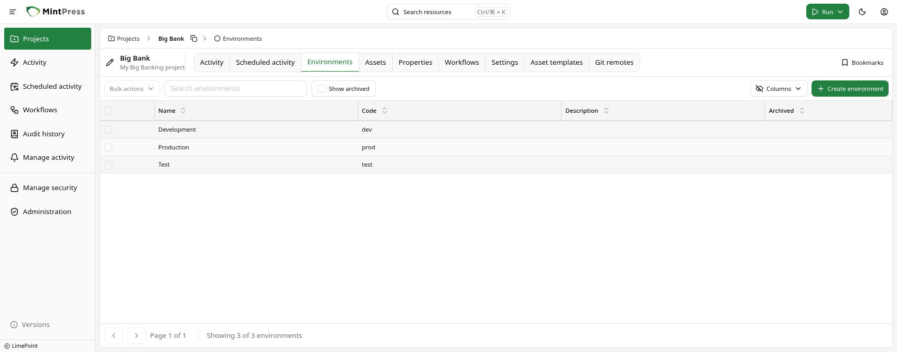
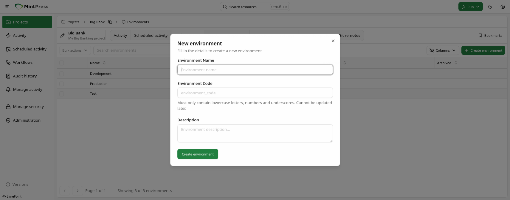
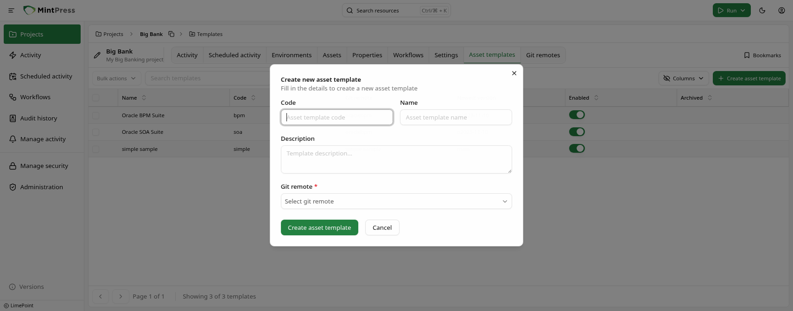
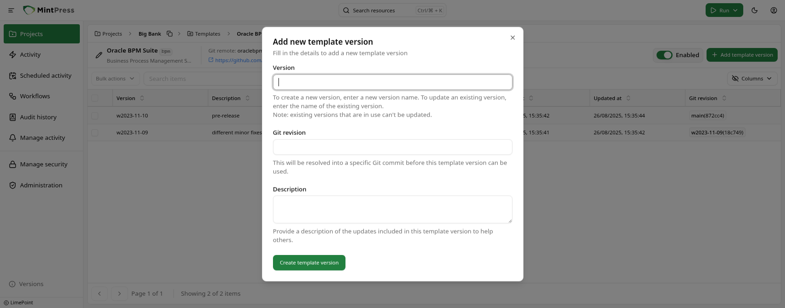
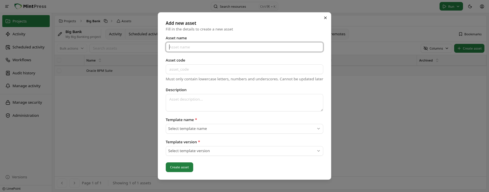

# Creating projects, environments and assets

Create OpsChain projects, environments and assets from which you'll be able to run changes.

After following this guide you should understand OpsChain's structure and know how to:

- create a project, an environment and an asset
- add a remote Git repository to a project
- create an asset template and a template version

## Projects

Projects are the top-level organizational unit in OpsChain. Any Git remotes, properties, settings and asset templates you define in the project will be available to all environments and assets within it.



### Creating an OpsChain project

Projects are created from the "Projects" page, accessible via the sidebar menu.

To create a project, click on the "Create project" button at the top right of the page.



Give the project a name, description, a unique code and click on "Create project" at the bottom of the dialog.

## Git remotes in OpsChain

OpsChain must be able to access your Git repositories to be able to run the actions defined in them.

In OpsChain, a Git remote is a named reference to a Git repository. It is used to securely store the credentials to access a single Git repository.

To add a Git remote to your project, click on the "Git remotes" tab in the project's page.



In the dialog that appears, give a name to your Git remote, paste in the Git repository link and add your credentials, either username/password or an SSH key (you can optionally provide the SSH key passphrase if required) and click "Add Git remote" at the bottom of the dialog.

Your Git remote will be ready for use once it is visible in the remotes list for the current project.

:::info
OpsChain supports multiple Git remotes per project, allowing you to run actions from different Git repositories at any moment.
:::

## Environments

Environments are the second level of the OpsChain structure. They are used to logically group assets (more on that later) and to provide an intermediate level for overriding your project's properties and settings.

When security is considered, you can create different environments for different teams, ensuring that each team only has access to the assets they are responsible for and the actions they are allowed to run.



### Creating an environment

To create an environment, click on the "Environments" tab in the project's page.

Click on the "Create environment" button at the top right of the page.



Give the environment a name, description, a unique code within the project and click on "Create environment" at the bottom of the dialog.

Your environment will be ready for use once it is visible in the environments list for the current project.

## Assets

Assets are the lowest level structure in OpsChain and can be created inside a project or an environment. Each asset is associated with a Git repository and a Git revision via an asset template version.

### Asset templates

To allow users to have different resources (defined by `actions.rb` files) within the same Git repository, OpsChain allows you to define asset templates. Asset templates in OpsChain can be seen as a way of referring to different `actions.rb` files within the same Git repository.

For example, if you have a Git repository with the following structure:

```text
my-project/
  db_server/
    actions.rb
  web_server/
    actions.rb
```

You can create two asset templates, one for `db_server` and one for `web_server`. The actions in `db_server` will be available for the assets using the `db_server` template and the actions in `web_server` will be available for the assets using the `web_server` template.

#### Creating an asset template

To create an asset template, click on the "Asset templates" tab in the project's page.



Provide a name, description and a unique code for the asset template, select a Git remote and click on "Create asset template" at the bottom of the dialog.

### Asset template versions

To stay in control of the changes made to an asset template, OpsChain allows you to create template versions to lock the actions of a given template to a specific Git revision. A template version always refers directly to a single Git revision in the asset template's Git repository.

To create a new template version, go to the asset template page and click on the "Add template version" button at the top right of the page.



Provide a version name, description and the Git revision for this version and click on "Create template version" at the bottom of the dialog. OpsChain will then fetch the Git revision, identify the actions available for the given template version and make them available for all the assets using it.

:::info Resolving a template version
For security concerns, OpsChain will resolve a template version at the time of creation. This means that if you provide a branch name as a revision, OpsChain will resolve the branch to the latest commit at the time of creation and will not fetch new changes unless you manually update the template version.
:::

:::note
Creating new template versions will not automatically update the assets using it. You will need to intentionally update the assets to use the new template version, or create new assets using the new template version. This is done to ensure you are in control of the changes made to your assets and avoids unexpected changes.
:::

### Creating an asset

With an asset template version created, you can now create an asset that will use this template version to execute the actions defined in the `actions.rb` file.

To create an asset, click on the "Assets" tab in the project's or environment's page.



Fill in the asset name, description, a unique code within the project or environment and select the asset template and template version. Click on the "Create asset" at the bottom of the dialog.

:::note
You can only create assets for validated and ready-to-use template versions. If a template version is "broken" (e.g. the Git revision is not valid or the actions are not valid), you will not be able to create an asset for it.
:::

## What to do next

- Learn how to [run Bash and Python scripts](/getting-started/tutorials/running-scripts.md) in your changes
- Learn how to use [secrets](/getting-started/tutorials/using-secrets-in-your-change.md) in your changes
- Dive deeper into OpsChain concepts in the [key concepts guides](../../category/key-concepts)
