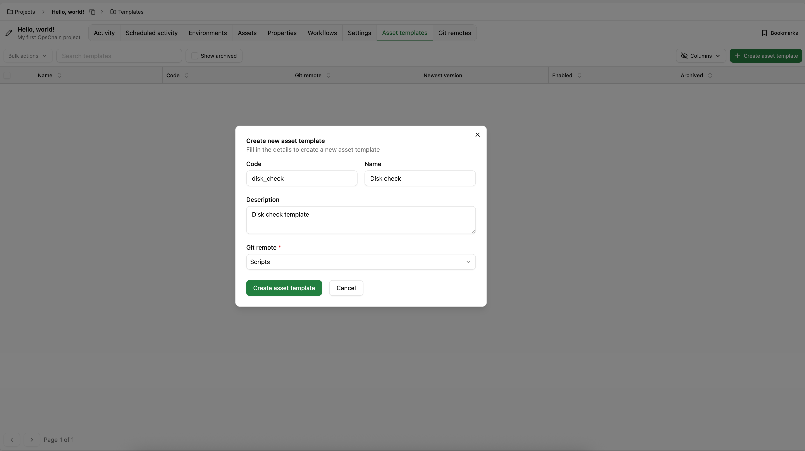
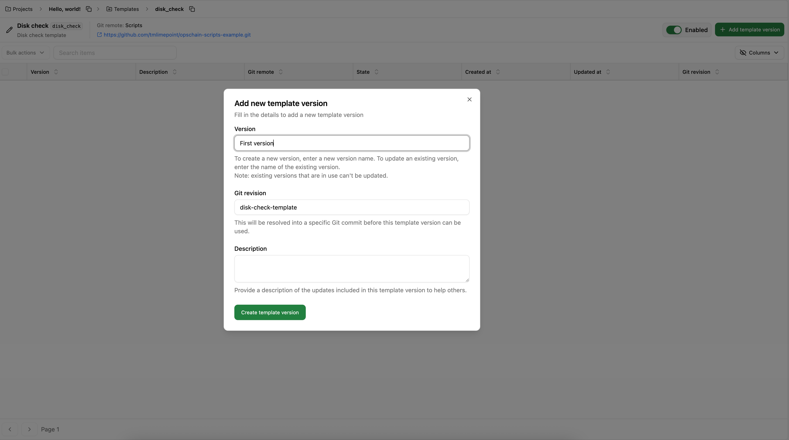
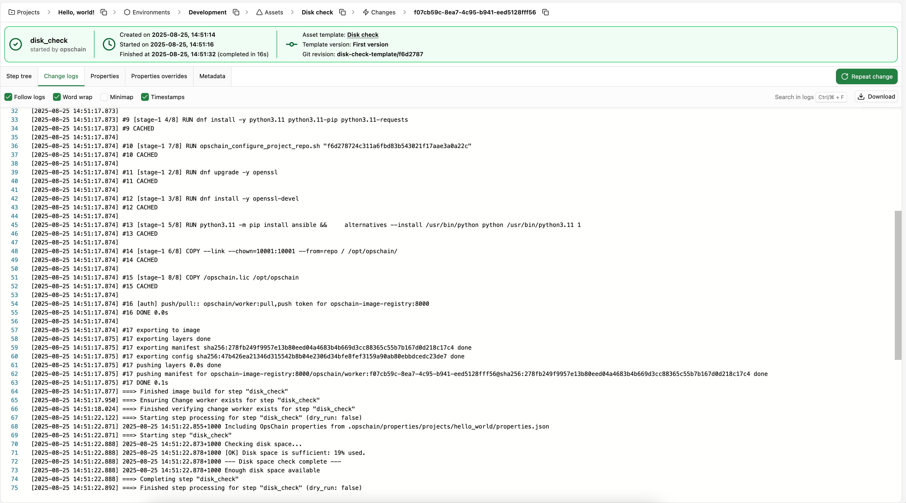
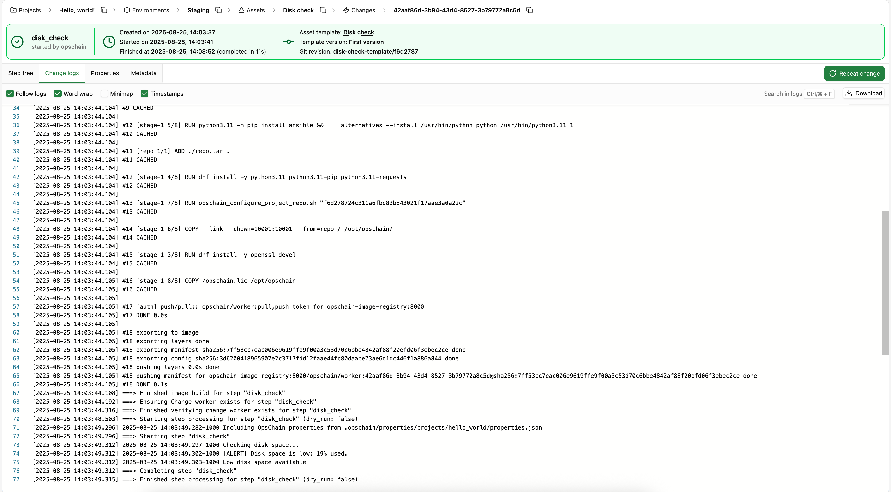

# Templating your actions

In the [previous tutorial](./running-scripts.md), we learned how to run scripts to perform a specific task. However, in a real-world scenario, you often need to run the same set of tasks across many similar but distinct resources, like a fleet of servers.

This is where OpsChain's **Asset Templates** come in. An Asset Template maps to a reusable `actions.rb` file stored in a folder with the template's name. You can then consider that specific `actions.rb` file as a reusable blueprint which defines a set of actions for a specific type of resource (e.g., a web server, a database, a microservice).

You can then create multiple **Assets**, in different environments, from this single template in the OpsChain UI, providing unique properties for each one (like a specific hostname or IP address). This allows you to write your automation logic once and apply it everywhere.

After following this guide you should know how to:

- use properties files in your Git repository
- create an asset template and a template version
- create assets from a template
- run actions on assets

## Prerequisites

To proceed with this tutorial, you must have:

- a Git remote that you can write to and is linked to an OpsChain project

We strongly suggest you follow the previous tutorials, ["Running scripts"](/getting-started/tutorials/running-scripts.md) and ["Creating projects, environments and assets"](/getting-started/tutorials/structure.md) first to get familiar with the basics of OpsChain and learn how to link your Git repository to an OpsChain project. This tutorial expects you to write, commit and push changes to your Git repository.

## Defining your template

Let's walk through how to create and use an Asset Template for managing different resources. We will use the `disk_check.sh` Bash script from the [previous tutorial](./running-scripts.md#running-a-bash-script).

OpsChain will look for asset templates in a folder that matches the template's code in the root of your Git repository. For example, if you have a template called `disk_check`, OpsChain will look for a folder called `disk_check`.

:::note Codes
OpsChain only supports lowercase letters, numbers and underscores in template codes, so plan your folder structure accordingly.
:::

For this tutorial, we will create a template that does a simple disk space check. First, create the following directory structure in your repository:

```text
.
├── disk_check/
│   └── actions.rb
│   └── disk_check.sh
```

## Using Git repository properties

To enhance our automation experience, let's also make use of the Git repository properties as a default set of properties for our actions.

OpsChain will automatically fetch properties from the [OPSCHAIN_REPO_FOLDER](/setup/understanding-opschain-variables.md#opschain_repo_folder) directory, where we can map our OpsChain structure to define properties for each structural level (project, environment, asset).

For this example, let's define properties for our project. For the default `OPSCHAIN_REPO_FOLDER` value and the `hello_world` project we created in previous tutorials, we can define these properties in the `.opschain/properties/projects/hello_world/properties.json` file.

```json
{
  "disk_check": {
    "disk_threshold": 80
  }
}
```

This will make these properties available for all actions running in our `hello_world` project. You can read more about how to use properties in the [Properties](/key-concepts/properties.md) section.

## Defining the template's actions

### The Bash script

For this example, we'll use the `disk_check.sh` script from the [previous tutorial](./running-scripts.md#running-a-bash-script), but instead of using a hardcoded value, we'll compare the disk usage with the value found in the `disk_threshold` property. Don't forget to make the script executable by running `chmod +x disk_check.sh` after creating it.

```bash
#!/bin/bash

# Set the script to exit if any command fails or if any variable is not set
set -eo pipefail -o nounset

echo "Checking disk space..."

# *** This is the only change from the previous tutorial. ***
# Using the first argument passed to the script as the disk threshold.
DISK_THRESHOLD=$1

CURRENT_DISK_USAGE=$(df / | grep / | awk '{ print $5 }' | sed 's/%//g')

if [ "$CURRENT_DISK_USAGE" -gt "$DISK_THRESHOLD" ]; then
  echo "[ALERT] Disk space is low: ${CURRENT_DISK_USAGE}% used."
  # Exit with a special exit code to indicate low disk space
  exit 255
else
  echo "[OK] Disk space is sufficient: ${CURRENT_DISK_USAGE}% used."
fi

echo "--- Disk space check complete ---"
```

### The template's `actions.rb`

The heart of our template is the `actions.rb` file inside the `disk_check/` directory. This file defines the actions that will be available to every asset created from this template.

The example below is similar to the one from the [previous tutorial](./running-scripts.md#running-a-bash-script), but it is passing the `disk_threshold` property as an argument to the script. We are also defining a description to our action so it can be displayed in the OpsChain UI. Actions without a description will not be displayed in the UI.

```ruby
# disk_check/actions.rb

action :disk_check, description: 'Check if there is enough disk space available' do
  # OpsChain executes from the root of the Git repository, so we need to specify the full path to the script.
  command_result = exec_command('disk_check/disk_check.sh', OpsChain.properties.disk_check.disk_threshold)

  if command_result.exitstatus.zero?
    OpsChain.logger.info 'Enough disk space available'
  elsif command_result.exitstatus == 255
    OpsChain.logger.info 'Low disk space available'
  else
    OpsChain.logger.error "Disk space check failed with exit code #{command_result.exitstatus}"
    OpsChain.logger.error command_result.stderr
  end
end
```

The `actions.rb` for a template follows the same rules and conventions as the `actions.rb` in the root folder. You can read more about it in the [actions reference](/docs/key-concepts/actions.md) guide.

:::warning Action compounding
If you are using the same repository as the previous tutorial, you will have the `disk_check` action already defined in the `actions.rb` file in the root folder.
If you don't remove it from that file, OpsChain will first run the action from the root folder, and then the action from the template folder. This follows the pattern of [Rake tasks](https://ruby.github.io/rake/), where actions with the same name will be appended to each other.

To prevent that behaviour, you can either remove or rename the `disk_check` action from the `actions.rb` file in the root folder.
:::

## Using the template in OpsChain

Once you commit and push this new directory structure to your Git repository, you can start using it in OpsChain.

### Create an Asset Template

In your OpsChain project, navigate to "Asset templates" and create a new one.
Point it to your Git remote and use the folder name as the **Template code**, in this case it's `disk_check`.



### Create a Template Version

Once the template is created, you can create a new version by clicking on the "Versions" tab and clicking the "Add template version" button.
We then give it a name and specify the Git revision this version should be locked to. In our case, we pushed our code to the `disk-check-template` branch and we'll use that as our Git revision.



### Create Assets

Now, you can create multiple assets from this template. They can be directly under the project or be children of different environments.
In this tutorial, we'll create two environments, `Development` and `Staging` and create one asset in each environment, such that we have the following structure in OpsChain:

```text
Projects/
├── hello_world/
│   ├── Development/
│   │   └── disk_check/
│   └── Staging/
│       └── disk_check/
```

## Running actions on assets

We can now run our `disk_check` action on either of the assets we created. Since we have provided a description to our action, we can see it is already available for selection in the UI.


Since we have defined our properties in the Git repository, we can just run the change and OpsChain will automatically use the properties from the Git repository.



### Customizing the action

In real world scenarios, different environments usually mean different requirements and properties. We can customize the `disk_check` action for our `Staging` environment by overriding the Git repository properties in the environment itself.
The example below shows us setting the `disk_threshold` property to `10` in the `Staging` environment's properties.


When we run the action with the overriden properties, we can see that the disk space check now considers the new threshold.



It is important to note that we could also override these properties in the project, the asset or in the change individually. This allows you to have a single template that can be used in different environments with properties overrides in different levels, making your actions much more flexible and reusable.

:::info Auditability
The properties in projects, environments and assets are versioned and any change to them is tracked, so you can always see the history of changes and revert to a previous version if needed.
:::

## What to do next

- See some [sample projects](/getting-started/tutorials/samples.md) for more advanced use cases
- Dive deeper into OpsChain concepts in the [key concepts guides](../../category/key-concepts)
