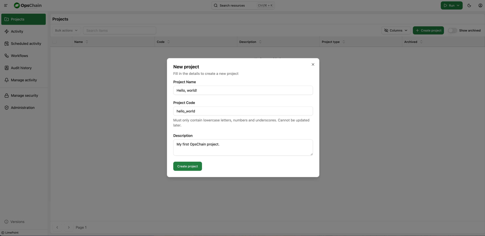
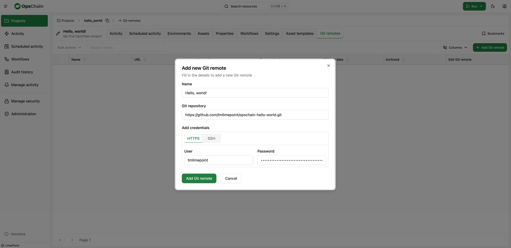
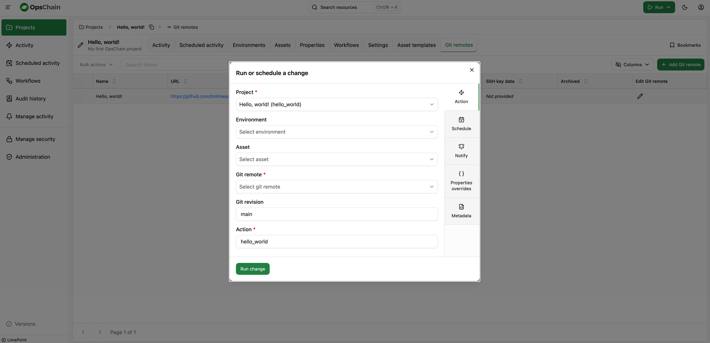
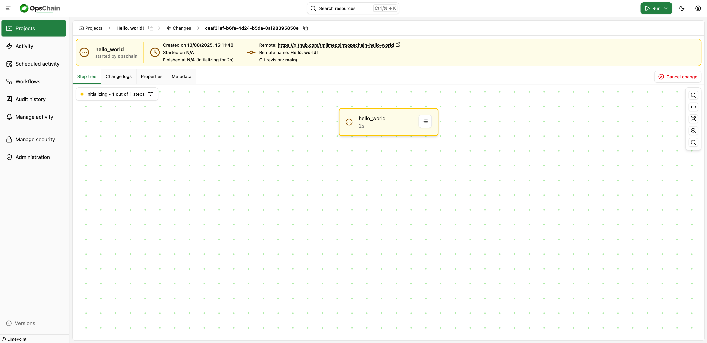
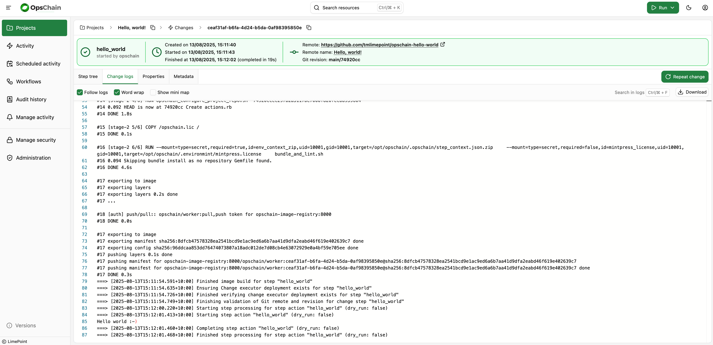

# "Hello, world!" with OpsChain

Learn how to use OpsChain to run a simple "Hello, world!" script stored in a Git repository.

After following this guide you should know how to:

- minimally configure any Git repository to be used by OpsChain
- create OpsChain projects to organize your execution pipeline
- connect a remote Git repository to an OpsChain project
- run a script using OpsChain

## Prerequisites

To proceed with this tutorial, you must have:

- a Git repository you can write and OpsChain can connect to
- Git credentials (username/password or a [personal access token (PAT)](https://docs.github.com/en/github/authenticating-to-github/creating-a-personal-access-token)) that OpsChain will use for accessing your Git repository
- a working OpsChain instance you can access and log in to
- authorisation to create projects in the given OpsChain instance

## Preparing your Git repository

### Understanding Git revisions

import GitRevision from '/files/partials/git-revision.md'

<GitRevision />

Whenever you want to execute any code using OpsChain, you'll _always_ need to provide the Git repository and Git revision that point to the code that OpsChain will run. OpsChain provides utilities and structures to make managing those easier. We'll look at the different ways of linking your Git repository and revisions in upcoming tutorials.

### Defining your actions

The first thing that OpsChain will look up after fetching your Git repository is for an `actions.rb` file at the root of your repository.
This file is where you define the _actions_ that you can run from OpsChain.

An _action_ can be any code written in [Ruby](https://www.ruby-lang.org/), including calling and importing other files, making HTTP requests or executing shell scripts.

As a simple example, in your Git repository, we can define a `hello_world` action by adding this code to an `actions.rb` file at the repository's root folder:

```ruby
action :hello_world do
  OpsChain.logger.info 'Hello world :-)'
end
```

After saving the `actions.rb` file, making a commit and pushing it to our Git remote, we are ready to run this code in OpsChain.

:::tip Using commit SHAs
You can get the latest commit's SHA in a Git repository by running:

```bash
git rev-parse --verify HEAD
```

:::

## Creating an OpsChain project

With a working OpsChain instance, log in using your credentials and reach the "Projects" page from the sidebar.

Click on the "Create project" button at the top right, give the project a name and a code and click on "Create project" at the bottom of the dialog.



Wait for the project to appear in your projects list and click on it when it does.

## Adding a Git repository to your project

Inside the project's page, click on the "Git remotes" tab and then on "Add git remote".



Give it a name, paste in the Git repository link and add your credentials, either username/password or an SSH key (you can optionally provide the SSH key passphrase if required) and click "Add Git remote" at the bottom of the dialog.

Your Git remote will be ready for use once it is visible in the remotes list for the current project.

:::info
OpsChain supports multiple Git remotes per project, allowing you to run actions from different Git repositories at any moment.
:::

## Running the actions from the Git repository

Now that we have linked a Git remote to our project, we can run the `hello_world` action we defined in the `actions.rb` file.

Using the "Run" button at the top of the screen, click on "Run change". The project will be automatically selected if you are on the project page, so we just need to select the Git remote we'll use.



Select the Git remote you just added, add the Git revision OpsChain should use to fetch the code and write the action name we defined in our `actions.rb` file.

Click on "Run change" at the bottom of the dialog and we're done!

The UI will take us to the change screen, where we'll be able to follow our change's progress until it's completed.



## Following your change's logs

In your change's page, you can see the change logs on the "Change logs" tab.



The logs are updated in real time as OpsChain builds the runner image and the code executes. At the end of the change execution, you should see the `Hello world :-)` message printed by our code in the `actions.rb` file.

:::tip Change logs
The logs generated by OpsChain will stay available in the change page even after the change has finished.

If you'd like to share your change's logs as a file, there is a "Download" button inside the "Change logs" tab.
:::

## What to do next

- Learn more about [how to organize your OpsChain instance](./structure.md)
