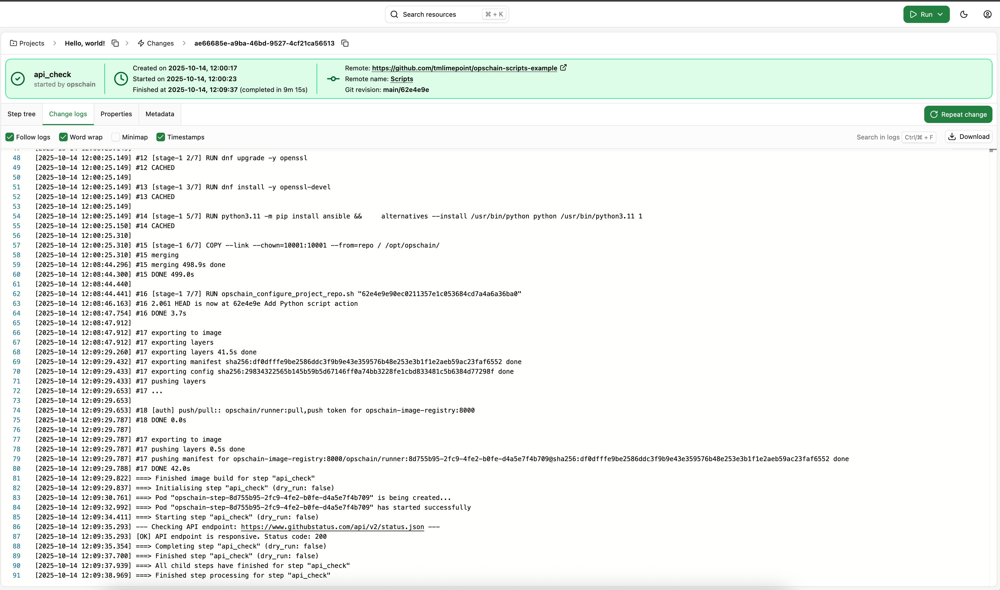

# Bash and Python scripts

Learn how to use OpsChain to run any command, like Python and Bash scripts.

After following this guide you should:

- understand how OpsChain executes changes
- know how to:
  - configure your runner image to suit your needs
  - use OpsChain to run Python and Bash scripts
  - use OpsChain's properties framework to pass arguments to modify your actions

## Prerequisites

To proceed with this tutorial, you must have:

- a Git remote that you can write to and is linked to an OpsChain project

We strongly suggest you follow the ["Hello, world!" tutorial](/getting-started/tutorials/hello-world.md) and ["Creating projects, environments and assets"](/getting-started/tutorials/structure.md) first to get familiar with the basics of OpsChain and learn how to link your Git repository to an OpsChain project. This tutorial expects you to write, commit and push changes to your Git repository.

## The change environment

Every change in OpsChain is executed in a runner container, an isolated environment with controlled features and dependencies. The containers are defined by their Dockerfiles, which are built into runner images. OpsChain provides a default Dockerfile that gets built into a runner image with a set of utilities and packages to help you run your code.

However, if you need to install additional libraries and tools, you can provide a [custom Dockerfile](/key-concepts/step-runner.md#creating-a-custom-step-runner-dockerfile) to build a custom runner image with additional libraries and tools to match your specific needs. We'll explore that in the [Running Python](#running-python-scripts) section.

## Running a Bash script

Let's start with a simple Bash script that checks the status of our host's disk space and exits with a special exit code if the disk space is low. We can create a new file called `disk_check.sh` at the root of our Git repository. For running simple Bash scripts, the default runner image is enough.

```bash
#!/bin/bash

# Set the script to exit if any command fails or if any variable is not set
set -eo pipefail -o nounset

echo "Checking disk space..."
DISK_THRESHOLD=80
CURRENT_DISK_USAGE=$(df / | grep / | awk '{ print $5 }' | sed 's/%//g')

if [ "$CURRENT_DISK_USAGE" -gt "$DISK_THRESHOLD" ]
then
    echo "[ALERT] Disk space is low: ${CURRENT_DISK_USAGE}% used."
    # Exit with a special exit code to indicate low disk space
    exit 255
else
    echo "[OK] Disk space is sufficient: ${CURRENT_DISK_USAGE}% used."
fi

echo "--- Disk space check complete ---"
```

:::tip File permissions
Don't forget to make the script executable. You can do this by running `chmod +x disk_check.sh` after creating the file.
:::

With our script defined, we can now create a new action in our `actions.rb` file to execute it. OpsChain provides an [`exec_command`](/key-concepts/actions.md#opschain-exec_command) method to run shell commands and interact with their outputs and status.

```ruby
action :disk_check do
  # The stdout of the command will be in OpsChain's change logs by default
  # abort_on_failure: false ensures the command won't raise an error if it fails, we want to provide a custom error handling logic instead.
  command_result = exec_command('./disk_check.sh', abort_on_failure: false)

  # The process terminated with our special exit code
  if command_result.exitstatus == 255
    log.info 'Low disk space available'
  elsif command_result.success?
    log.info 'Enough disk space available'
  # The process terminated with an unexpected exit code
  else
    log.error "Disk space check failed unexpectedly with exit code #{command_result.exitstatus}"
    log.error command_result.stderr
  end
end
```

:::tip
You can read more about the `exec_command` method and its arguments in the [actions reference guide](/key-concepts/actions.md#opschain-exec_command).
:::

We can now commit and push our changes to our Git repository and run the action from our OpsChain project. Below is a screenshot of the change logs for the `disk_check` action as defined above.


## Running Python scripts

To run Python scripts, we need to ensure we have Python and the necessary packages installed in our runner image first.

### Configuring your runner image

:::warning Default runner image configuration
To properly run changes in OpsChain, some functionalities are required on all runner images. So it is important not to remove any of the original lines from the default runner image. Instead, simply add your custom configuration in the relevant areas. You can read more about the default runner image in the [key concepts guide](/key-concepts/step-runner.md#creating-a-custom-step-runner-dockerfile).
:::

The OpsChain runner default image provides some basic utilities and packages to help you run your code. However, you may need to install and configure additional packages depending on your use case. To do so, you can define a custom `Dockerfile` in your Git repository.

For a single custom Dockerfile per repository, OpsChain expects to find it in the [OPSCHAIN_REPO_FOLDER](/setup/understanding-opschain-variables.md#opschain_repo_folder) directory. Using the default value, OpsChain will expect the Dockerfile to be at `.opschain/Dockerfile` in your Git repository.

:::tip
The first time a change with a custom runner image is run, the runner image is built from scratch. This can take a while, so it is important to keep the runner image as small as possible.
:::

### Example custom Dockerfile with Python

The Dockerfile below, based on the [OpsChain's default Dockerfile](/key-concepts/step-runner.md#creating-a-custom-step-runner-dockerfile), installs Python 3, the pip package manager and the `requests` library.

```dockerfile
# syntax = docker/dockerfile:1.4
### ---- Default runner image configuration part 1 ----

ARG OPSCHAIN_BASE_RUNNER

FROM scratch as repo
ADD ./repo.tar .

FROM scratch as trust_store
ADD ./opschain-trust-store.tar .

FROM ${OPSCHAIN_BASE_RUNNER}
### ----

### Custom configuration
# Install Python 3 and the pip package manager
RUN dnf install -y python3 python3-pip python3-requests && \
    alternatives --install /usr/bin/python python /usr/bin/python3 1
### ----

### ---- Default runner image configuration part 2 ----
COPY --link --chown=10001:10001 --from=trust_store / /etc/pki/ca-trust/source/anchors
COPY --link --chown=10001:10001 --from=repo / /opt/opschain/

ARG GIT_REV
ENV GIT_REV=$GIT_REV

ARG GIT_SHA
RUN opschain_configure_project_repo.sh "$GIT_SHA"

USER opschain
RUN --mount=type=secret,required=true,id=env_context_zip,uid=10001,gid=10001,target=/opt/opschain/.opschain/step_context.json.zip \
    --mount=type=secret,required=false,id=mintpress_license,uid=10001,gid=10001,target=/opt/opschain/.environmint/mintpress.license \
    bundle_and_lint.sh
### ----
```

:::tip
It is important to understand how Dockerfiles, the image build process and caching work in order to have performant image builds. Refer to the official [Dockerfile reference](https://docs.docker.com/reference/dockerfile/) guide for more information.
:::

### Defining our Python script action

Now that our runner image is configured with the necessary tools, we can define actions to run our Python scripts.

A common use case for Python is automating interactions with web services. Let's create a script that checks the health of an external API. This requires the popular `requests` library that we installed in our custom runner image.

First, let's create the Python script `api_check.py`. This script takes a URL as an argument, makes an HTTP request to it, and exits with a success or failure code based on the response status code.

```python
import requests
import sys

def check_api_status(url):
    """
    Makes a GET request to the given URL and checks for a 200 OK status.
    Exits with 0 on success, 1 on failure.
    """
    print(f"--- Checking API endpoint: {url} ---")
    try:
        # Make the GET request with a 10-second timeout
        response = requests.get(url, timeout=10)

        if response.status_code == 200:
            print(f"[OK] API endpoint is responsive. Status code: {response.status_code}")
            sys.exit(0)
        else:
            print(f"[ALERT] API endpoint returned a non-200 status code: {response.status_code}")
            print(f"Response: {response.text}")
            sys.exit(1)
    except requests.exceptions.RequestException as e:
        print(f"[CRITICAL] Failed to connect to API endpoint. Error: {e}")
        sys.exit(1)

if __name__ == "__main__":
    # Expect the URL to be passed as the first command-line argument
    if len(sys.argv) < 2:
        print("Usage: python3 api_check.py <URL>")
        sys.exit(1)

    api_url = sys.argv[1]
    check_api_status(api_url)
```

Finally, we can define the action in `actions.rb` to run the Python script. To make our action flexible, we're going to make use of OpsChain's properties framework to provide the API URL we'll call as a property to our action. The action will then pass the API URL as a command-line argument to the script and check the exit status to determine the result.

```ruby
action :api_check do
  # Check GitHub's public API status endpoint by default, but allow the user to override it with a property
  api_url = OpsChain.properties.api_url || 'https://www.githubstatus.com/api/v2/status.json'

  # All we need to do is run the script:
  # If the command succeeds, the Python script's output will be shown in the change logs.
  # If the command fails, the step will be marked as failed and the error message will be shown in the change logs.
  exec_command('python3', 'api_check.py', api_url)
end
```

After committing these files and running the `api_check` action, you will see the output of the Python script in your change logs.



In case of our Python script failing to connect to the API endpoint, like if we provided an invalid URL for example, the change will automatically be marked as failed and we will see the error message in the change logs.


### Overriding properties

Since we're using the OpsChain properties framework in our action, we can modify the properties our action will use to send the HTTP request to another API endpoint.


By looking at the change logs, we can see the endpoint our script has used matching the property we set.


## What to do next

- Learn [how to template your actions](./templated-actions.md)
- Dive deeper into OpsChain concepts in the [key concepts guides](../../category/key-concepts)
